

# Escape: Oh Dear Dragon!

# Table of Contents

1. [Introduction](#1-introduction)
2. [Development Team](#2-development-team)
3. [Requirements](#3-requirements)
4. [Design](#4-design)
5. [Implementation](#5-implementation)
6. [Evaluation](#6-evaluation)
7. [Process](#7-process)
8. [Sustainability, Ethics, and Accessibility](#8-sustainability-ethics-and-accessibility)
9. [Conclusion](#9-conclusion)
10. [Contribution Statement](#10-contribution-statement)
11. [AI Statement](#11-ai-statement)

# 1. Introduction

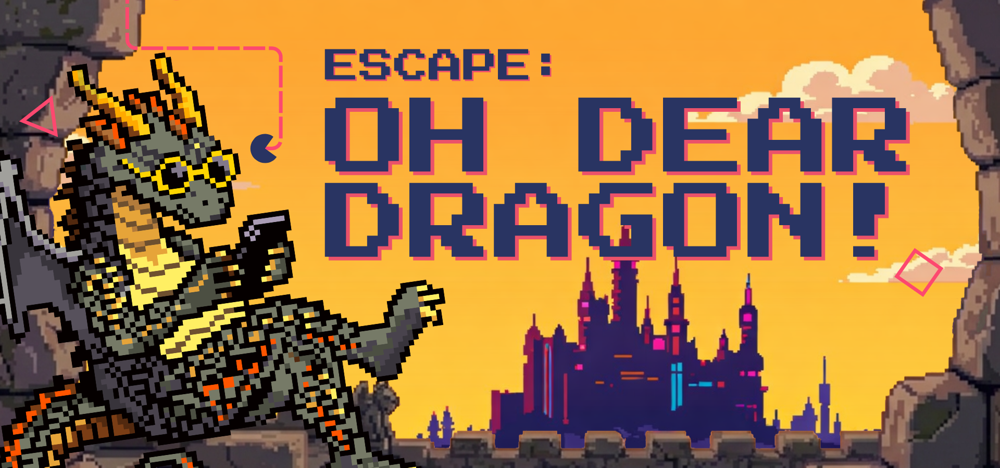

**Escape: Oh Dear Dragon!** is a 2D top-down stealth game with a neon-cyberpunk castle aesthetic. Our brave hero sneaks through the castle's many chambers, each packed with patrolling guards, using stealth and subterfuge to reach the next level, and hopefully find the princess. Oh and did we mention portals? Yeah, we've got those too!

Our game is inspired by Invisible Inc., The WereCleaner, and the Thief series for their stealth-focused gameplay and emphasis on problem solving over direct confrontation. Players must study patrol routes and sneak through the castle, avoiding being seen (or heard), unless they want to become a snack for the stylish, sunglasses-wearing dragon. 

The twist mechanic was inspired by Valve's Portal series. Players can place linked portals to quickly and strategically navigate the castle's interior, bypass dangerous chokepoints, or recover from risky plays. This mechanic is built directly into our game's core stealth navigation, creating constant tactical choices between planning safe routes and improvising under pressure. 

  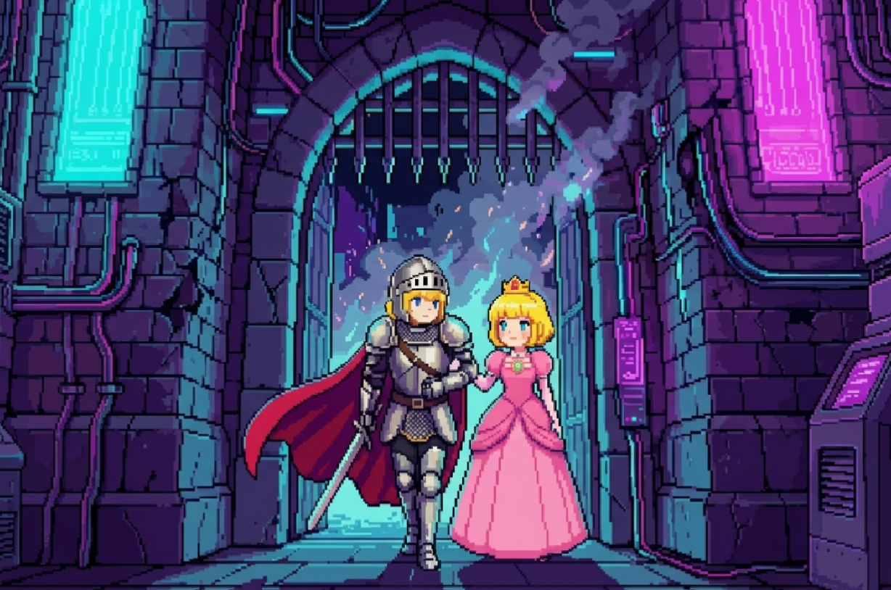

The story begins as an all too familiar fantasy trope - rescue the princess from the big bad dragon. However, we gradually subvert that premise as the player uncovers an uncomfortable truth: the truth behind the kingdom’s unrest is stranger, darker, and far less convenient than it first appears.

# 2. Development Team

  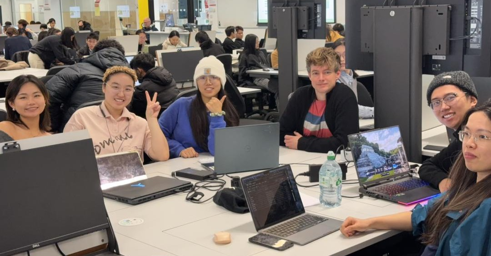

| Person        | Email                 | GitHub                 | Roles                                                      |
| ------------- | --------------------- | ---------------------- | ---------------------------------------------------------- |
| Yan Cui       | sk25619@bristol.ac.uk | @Tracy-fuyao           | Lead Developer, Architecture and Integration               |
| Yawen Zhang   | vm25514@bristol.ac.uk | @joan9yawen-source     | Front-end Developer, UX/UI Design                          |
| Hanqing Zhang | sv25099@bristol.ac.uk | @zhq1374547005-UOB     | Developer, Game Flow, Level Design, Video                  |
| Haris Kovac   | yw25220@bristol.ac.uk | @hariskovac            | Documentation, Developer, Music/SFX                        |
| Frida Chen    | ba25966@bristol.ac.uk | @fridachen1127         | QA Lead, Github Review, Documentation                      |
| Jinni Li      | ra25313@bristol.ac.uk | @Jinni-Li              | Project Manager, Front-end Developer, QA                   |

# 3. Requirements 

- 15% ~750 words
- Early stages design. Ideation process. How did you decide as a team what to develop? Use case diagrams, user stories.

## 3.1 Ideation
During the ideation process, team members took turns proposing their ideas. Our initial list contained several concepts, but three quickly became the frontrunners: a tactical stealth game inspired by Invisible Inc. and The WereCleaner, a rogue-like, and a Bomberman clone. The team spent a great deal of time debating on the merits of each idea, considering factors such as difficulty of implementation, originality, player enjoyment, and how excited we were about the concept as developers.

  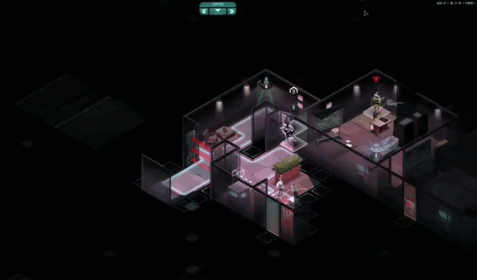  

Inspiration - Invisible Inc.

    

Inspiration - The WereCleaner

Due to the semester-long nature of the course, the difficulty and time it would take to implement a game became deciding factors. Because of that, we decided that the rogue-like would not be feasible to complete to a satisfactory level given our timeframe. We created paper prototypes for the remaining two ideas and presented them to classmates.

For the stealth game, we prototyped navigating around rooms, enemy field of view and alert bars, and collecting keys to advance further through the level. 

https://github.com/user-attachments/assets/9940a5db-5fca-4c4e-b8e4-658c5386039b

Video 1: Paper Prototype - Stealth Game

For the Bomberman idea, we prototyped map layout, power-ups, enemy behavior, and dropping bombs to destroy blocks and damage enemies, along with portal mechanics from the Portal game. Ultimately, we voted and decided that we would create the stealth game combined with portal mechanics as the twist, allowing the player additional mechanics for avoiding enemies and navigating levels. 

    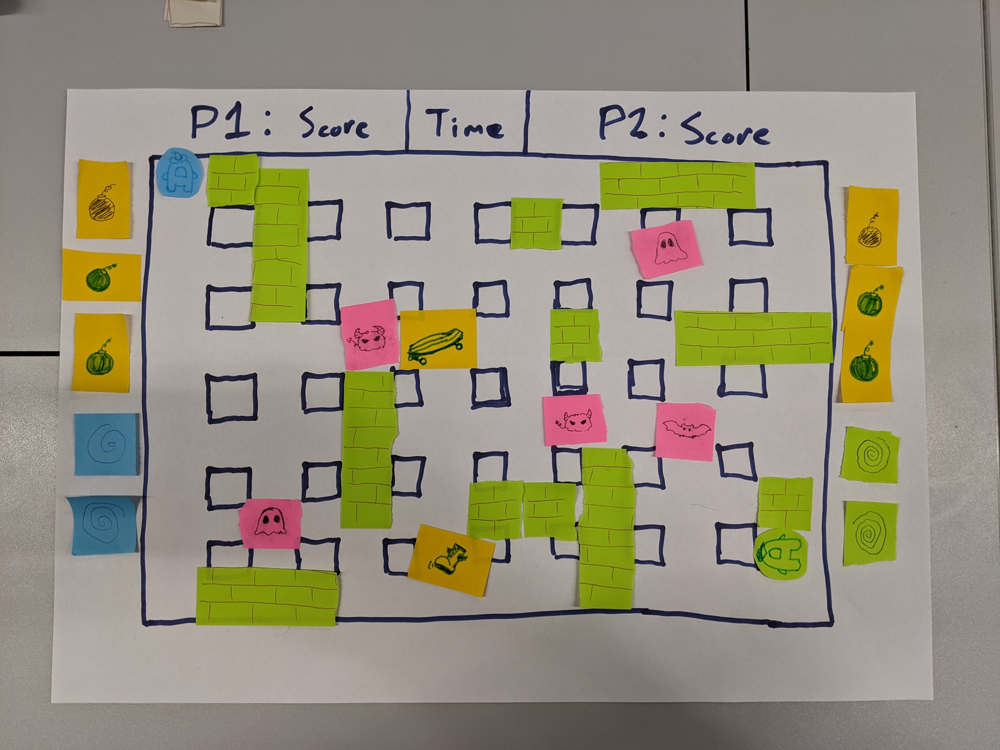    

Paper Prototype - Bomberman Clone

## 3.2 Stakeholders

The following figure shows our Stakeholder Onion Model, with layers indicated in the image.

    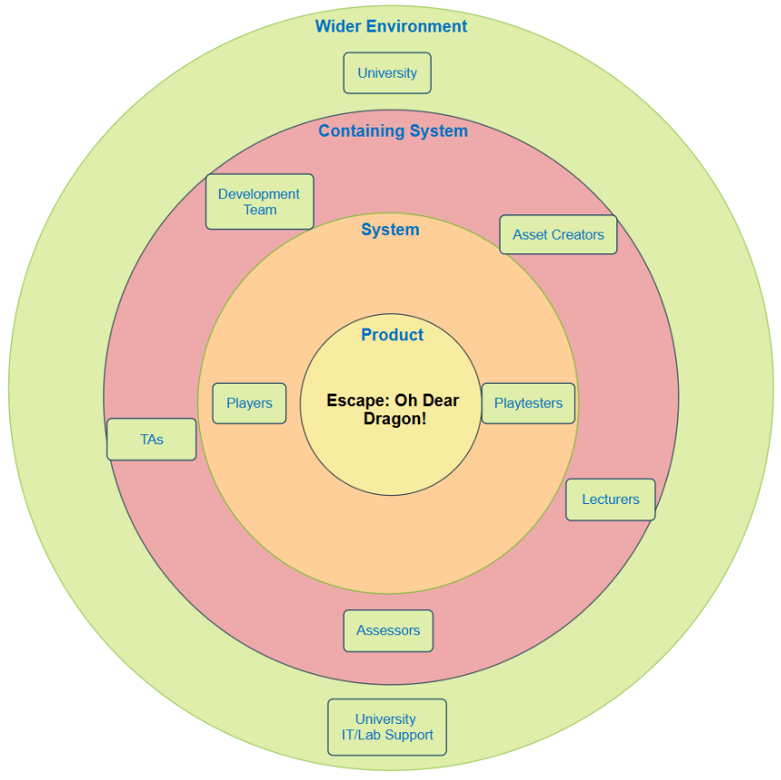    

Figure 1: Stakeholder Onion Model

The System ring captures direct users of the game (players/playtesters). The Containing System includes those who create, support, and evaluate the product (development team and teaching staff). The Wider Environment captures university-level constraints and infrastructure. Stakeholders here are represented as roles, though the same individuals may serve as lecturers/TAs and also act as assessors.

## 3.3 Epics and User Stories

We used an epic-driven approach to define our feature scope. Each epic represents a major gameplay system, with user stories capturing specific player needs. These stories were then tracked as GitHub issues to manage implementation and progress.

Our Epics include:
- **Epic 1**: Stealth and Movement
- **Epic 2**: Enemy Visibility and Feedback
- **Epic 3**: Rooms, Doors, and Progression
- **Epic 4**: Keys and Interactables
- **Epic 5**: Challenge and Learning Curve
- **Epic 6**: Portal Mechanics
- **Epic 7**: Inventory and Items
- **Epic 8**: Game Flow and Feedback

Below are the user stories for our first epic, Stealth and Movement. Please see the appendix for the remaining user stories.

**Epic 1: Stealth and Movement**

| Number        | User Story               | Priority                  | 
| ------------- | ------------------------ | ------------------------- | 
| U1.1          | As a player, I want responsive movement so I can position precisely to avoid enemy vision and alert zones.    | High            |
| U1.2          | As a player, I want walls, doors, and solid obstacles to block movement so navigation feels consistent.    | High            |
| U1.3          | As a player, I want obstacles and corners to provide cover so I can avoid line of sight strategically.    | High            |
| U1.4          | As a player, I want to switch between walking and sprinting so that I can trade safety for speed when escaping danger.    | High            |
| U1.5          | As a player, I want sprinting to generate visible/audible noise feedback so I understand when enemies may investigate.    | High            |
| U1.6          | As a player, I want guards to lose me when I successfully break line-of-sight so that stealth feels skill-based.    | High            |
| U1.7          | As a player, I want to fail only when a guard reaches me in a chase so that mistakes feel fair and understandable.    | High            |
| U1.8          | As a player, I want to preview nearby danger (panning camera) so I can scout safely before advancing.    | Medium            |

## 3.4 Use Case Diagram

To consolidate our user stories into a player-facing view of the system and scope the behavior we planned to implement, we created the use case diagram shown below. 

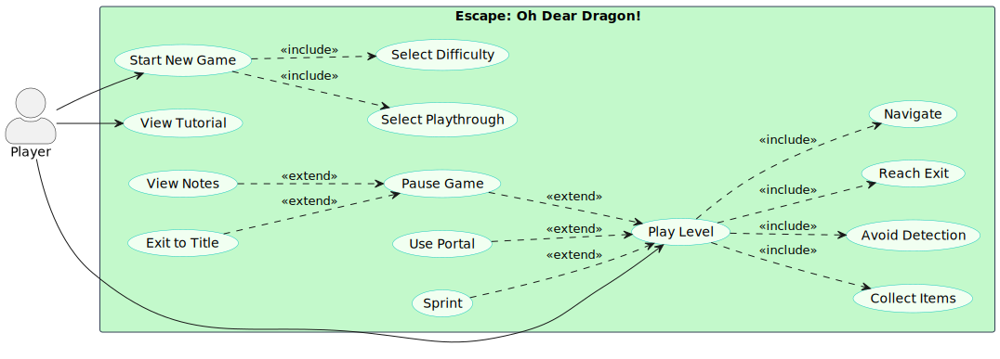

Figure 2: Use Case Diagram

The Player has three entry points into the system: starting a new game, viewing the tutorial, or playing a level. Starting a new game _includes_ selecting a playthrough and a difficulty as both are required to load a level. Playing a level _includes_ navigating the map, avoiding detection, collecting items in chests, and reaching the exit. These four are part of the core loop and can't be opted out of. Sprinting, using portals, or pausing the game are modelled as _extends_ relationships because they are optional, as the player can theoretically complete a level only by walking and using the base controls. Pausing the game _extends_ itself further into viewing collected story notes or exiting to the title screen. The full use case specification for the Play Level use case is given below.

| Field         | Specification            | 
| ------------- | ------------------------ | 
| Actor         | Player                   | 
| Pre-conditions               | The player has selected a playthrough variant and a difficulty level, the corresponding map has loaded, and the intro cutscene has finished    | 
| Basic Flow - Goal            | Collect every chest in the level, then reach the exit door without being caught by a guard.    | 
| Basic Flow - Step 1          | Player explores the level, avoiding guards and using movement, sprinting, interaction, and portals as needed.    | 
| Basic Flow - Step 2          | Player opens chests to collect keys and story notes. Opening every chest unlocks the exit door.    | 
| Basic Flow - Step 3          | Player reaches the unlocked exit door and presses E to exit. The win screen is shown.    | 
| Alternative Flow             | A guard detects the player and begins searching or chasing.            |
| Recovery Step                | Player breaks line of sight using walls, doors, or a portal before the guard reaches them. The guard searches the area and eventually resumes patrol.    |
| Failure                      | A guard in a CHASE catches the player and the lose screen is shown.   | 
| Post-conditions (Success)    | Narrative progress advances through a cutscene, and the player returns to the map select screen.   | 
| Playthrough Variation        | FOYER (easy) has a simple layout with few guards, large open spaces, and a direct path to the exit. LIBRARY (medium) has multiple connections between rooms, reduced room size, and more guards. SALON (hard) has the most complex layout and the greatest number of rooms, and a large number of guards patrolling confined spaces.    | 

# 4. Design

- 15% ~750 words 
- System architecture. Class diagrams, behavioural diagrams.

## 4.1 System Architecture

Escape: Oh Dear Dragon! is built upon p5.js, organized as ES modules under src/ with a layered architecture. At the top, main.js creates a p5 instance and forwards its hooks (setup, draw, keyPressed, mousePressed, etc.) into a single GameCore controller. GameCore then owns the per-frame loop and holds all other top level subsystems, including GameState, InputSystem, AudioSystem, a ScreenOverlaySystem that wraps a ScreenManager, and a Camera. GameCore.render() hands state off to the renderSystem, which handles maps, lighting, entities, fog of war, and UI.

Gameplay state lives inside a Level object built by mapFactory from map specs in mapManager. The Level object composes five gameplay systems (DoorSystem, BoxSystem, RoomSystem, MissionSystem, and PortalSystem) plus a Player and an array of NPCs, both of which extend an abstract Entity. The per-frame update in GameCore follows a fixed structure:

  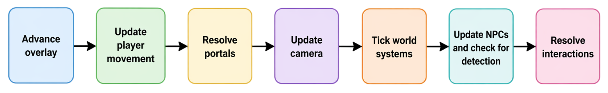  

NPC behavior is split across function modules (npcSystem, npcStateMachine, pathfindingSystem, npcTrackerSystem) rather than being handled by a single class. The NPC class contains NPC data, and the state machine is driven by external functions that handle things like reading vision cones, room lighting, and player footstep trails to decide what each guard does.

An abstract Screen class defines render, update, reset, handleKey/handleMouse hooks, and 13 screens inherit from it. ScreenManager holds the screens by name and forwards calls to whichever screen is active, and GameCore transitions between screens via a setScreen function which handles input resets, text, overlay, and audio. 

## 4.2 Class Diagram

```mermaid
---
title: Class Diagram
---
classDiagram
    direction LR

    class Entity {
        -x: number
        -y: number
        -w: number
        -h: number
        -facing: string
        -moving: boolean
        -anim: object
        -characterType: string
        -characterVariant: string
        +centerX
        +centerY
    }

    class Player {
        -speed: number
        -sprint: number
        -stamina: number
        -staminaMax: number
        -staminaDrain: number
        -staminaRecover: number
        -staminaRecoverDelay: number
        -recoverCooldown: number
        -moveX: number
        -moveY: number
        -footsteps: Array
        -footstepTrailX: number
        -footstepTrailY: number
        -lastFootstepAt: number
        -footstepSide: number
    }

    class NPC {
        -id: string
        -state: string
        -stateChangedAt: number
        -waypoints: Array
        -wpIndex: number
        -alert: number
        -alertLevel: number
        -alertThreshold: number
        -alertCooldown: number
        -lastSeenX/Y: number
        -searchTargetX/Y: number
        -searchBaseX/Y: number
        -searchReason: string
        -searchTimer: number
        -roomLightResponse: any
        -collisionInsetX/Y: number
        -speedPatrol: number
        -speedChase: number
        -patrolForward: boolean
        -patrolRouteJoined: boolean
        -doorCloseTarget: any
        -stuckSampleTimer: number
        -homeX/Y: number
        -vision: object
    }

    Entity <|-- Player
    Entity <|-- NPC

    class GameCore {
        -state: GameState
        -input: InputSystem
        -audio: AudioSystem
        -overlay: ScreenOverlaySystem
        -camera: Camera
        -currentLevelId: string
        -introAnimation: object
        -hudSyncTimer: number
        -frameCount: number
        -lastChasingNpcIds: Set
        -levelDirty: boolean
        +restartLevel()
        +switchLevel(levelId)
        +loadStoryLevel(levelId)
        +restartCurrentStoryRun()
        +resumeGame()
        +exitToTitle()
        +exitToPlaythroughSelect()
        +exitToDifficultySelect()
        +render(p)
        +onKeyPressed(key, keyCode)
        +onKeyReleased(key, keyCode)
        +onWindowBlur()
        +onMouseWheel(delta, mx, my)
        +onMousePressed(mx, my, btn, p)
        +onResize(w, h)
        +getState()
    }

    class GameState {
        -screen: string
        -previousScreen: string
        -levelId: string
        -level: Level
        -prompt: string
        -meta: object
        -ui: object
        -audio: object
        -inventory: Inventory
        -camera: Camera
        -loading: object
        -story: object
        -screenEnteredAt: number
        -screenTimeMs: number
        -nearestLightButton: any
    }

    class InputSystem {
        -pressed: Map
        -interactPressed: boolean
        -confirmPressed: boolean
        -portalPlacePressed: boolean
        -spaceHeld: boolean
        -LEFT_CODES/RIGHT_CODES/UP_CODES/DOWN_CODES/SPRINT_CODES: Set
        +onKeyPressed(key, code)
        +onKeyReleased(key, code)
        +onDomKeyDown(key, code)
        +onDomKeyUp(key, code)
        +getMovement() object
        +consumeInteract() boolean
        +consumeConfirm() boolean
        +consumePortalPlace() boolean
        +reset()
    }

    GameCore *-- GameState : owns
    GameCore *-- InputSystem : owns
    GameCore *-- AudioSystem : owns
    GameCore *-- ScreenOverlaySystem : owns
    GameCore *-- Camera : owns
    GameState *-- Inventory : owns
    GameState o-- Camera : references
    GameState o-- Level : current level

    class Level {
        -id: string
        -settings: object
        -collision: Array
        -player: Player
        -npcs: NPC[]
        -source: object
        -spec: object
        -mapData: object
        -mapWidth: number
        -mapHeight: number
        -worldWidth: number
        -worldHeight: number
        -doorSystem: DoorSystem
        -boxSystem: BoxSystem
        -roomSystem: RoomSystem
        -missionSystem: MissionSystem
        -portalSystem: PortalSystem
    }

    Level *-- Player : owns
    Level *-- NPC : owns many
    Level *-- DoorSystem : owns
    Level *-- BoxSystem : owns
    Level *-- RoomSystem : owns
    Level *-- MissionSystem : owns
    Level *-- PortalSystem : owns

    class Camera {
        -x/y: number
        -width/height: number
        -deadZoneX/Y: number
        -smoothing: number
        -worldWidth/Height: number
        -targetX/Y: number
        -zoom: number
        -minZoom/maxZoom: number
        -zoomSmoothing: number
        +resize(w, h)
        +setZoom(zoom)
        +changeZoom(delta, cx, cy) number
        +configureBounds(mwTiles, mhTiles, tileSize)
        +update(player, deltaTime)
        +worldToScreen(x, y) object
        +screenToWorld(x, y) object
        +isRectVisible(x, y, w, h, pad) boolean
        +getVisibleTileBounds(tileSize, mw, mh) object
    }

    class DoorSystem {
        -doors: Array
        -tileSize: number
        -collision: Array
        -activePushes: Map
        +unlock(door, keyId)
        +open(door, options)
        +close(door)
        +blocksTile(tx, ty) boolean
        +isDoorTile(tx, ty) boolean
        +update(deltaTime, entities)
    }

    class BoxSystem {
        -boxes: Array
        +open(box)
        +update(deltaTime)
    }

    class RoomSystem {
        -matrix: Array
        -rooms: Map
        -roomTiles: Map
        -buttons: Array
        -attachedNpcs: NPC[]
        -baseTile: number
        -chaseVisionMultiplier: number
        -darkVisionMultiplier: number
        -normalVisionMultiplier: number
        +attachNpcs(npcs)
        +getRoomId(tx, ty) string
        +getActorRoomId(actor) string
        +isLit(roomId) boolean
        +isExplored(roomId) boolean
        +exploreRoom(roomId)
        +resetExploration()
        +explorePlayerRoom(player)
        +getNpcVisionRange(npc, baseRange) number
        +getNearestButtonForPlayer(player, maxDist) any
        +toggleRoom(roomId, source)
        +notifyNpcsOfLightChange(roomId, source)
        +consumeButtonResponse(button, source)
        +update(deltaTime)
        +getUnexploredRooms() Array
    }

    class MissionSystem {
        -exit: object
        +unlock()
        +update(deltaTime)
        +isUnlocked() boolean
        +getObjectiveText(collected, target) string
        +getDistanceToExit(player) number
        +isPlayerInside(player, margin) boolean
        +getInteractPrompt() object
    }

    class PortalSystem {
        -tileSize: number
        -maxPortals: number
        -placementScanExtraTiles: number
        -triggerScale: number
        -teleportCooldownDuration: number
        -exitOffsetTiles: number
        -portals: Array
        -nextPortalId: number
        -nextPortalColor: string
        -teleportCooldown: number
        -lastTouchedPortalId: any
        +getPortals() Array
        +clear()
        +tryPlaceInFront(player, level) object
        +updatePlayerTeleport(player, level, dt)
    }

    class AudioSystem {
        -tracks: object
        -sfx: object
        -lastSfxAt: Map
        -activeLoopingSfx: Map
        -currentKey: string
        -muted: boolean
        -unlocked: boolean
        +getTrackKeyForScreen(screenKey, levelId) string
        +sync(screenKey, levelId)
        +unlock()
        +stopAll()
        +playSfx(key, options)
        +playSfxDelayed(key, delayMs, options)
        +setLoopingSfx(key, active)
        +toggleMute()
        +setMuted(value)
        +getState() object
    }

    RoomSystem o-- NPC : tracks

    class Inventory {
        -keys: Array
        -note: number
        -notesCollected: Array
        +addKey(keyId)
        +addNote(noteId)
        +hasKey(keyId) boolean
        +consumeKey(keyId) boolean
        +toString() string
        +toJSON() object
    }

    class LootTable {
        -levelId: string
        +collect(chestId, inventory) object
        +countTotalKeys() number
        +countTotalNotes() number
        +countTotalKeys(levelId)$ number
        +countTotalNotes(levelId)$ number
    }

    LootTable ..> Inventory : operates on

    class MinHeap {
        -data: Array
        -compare: Function
        +size
        +push(value)
        +pop() any
        -bubbleUp(index)
        -bubbleDown(index)
    }

    class Screen {
        <<abstract>>
        -name: string
        -promptText: string
        +render(p, state)*
        +update(state, deltaTime)
        +reset(state)
        +handleKey(key, state, api) boolean
        +handleMouse(mx, my, p, state, api) boolean
    }

    class StartScreen {
        -menu: object
        +reset()
        +handleKey(key, state, api)
        +render(p, state)
    }

    class PlayingScreen {
        +handleKey(key, state, api)
        +render(p, state)
    }

    class PauseScreen {
        +handleKey(key, state, api)
        +render(p, state)
    }

    class WinScreen {
        +handleKey(key, state, api)
        +render(p, state)
    }

    class LoseScreen {
        +handleKey(key, state, api)
        +render(p, state)
    }

    class CreditsScreen {
        +handleKey(key, state, api)
        +render(p, state)
    }

    class MapSelectScreen {
        -selectedIndex: number
        +handleKey(key, state, api)
        +render(p, state)
    }

    class DifficultySelectScreen {
        -selectedIndex: number
        +handleKey(key, state, api)
        +render(p, state)
    }

    class PlaythroughSelectScreen {
        -selectedIndex: number
        -eKeyHolding: boolean
        -eKeyTimer: number
        +handleKey(key, state, api)
        +render(p, state)
    }

    class IntroScreen {
        -cutscene: CutscenePlaybackController
        +reset()
        +update(state, dt, api)
        +handleKey(key, state, api)
        +render(p, state)
    }

    class TutorialScreen {
        -pageIndex: number
        -turnDir: number
        -turnT: number
        -turning: boolean
        -eKeyTimer: number
        -eKeyHolding: boolean
        +render(p, state)
    }

    class FalseEndingScreen {
        -cutscene: CutscenePlaybackController
        +reset()
        +update(state, dt, api)
        +handleKey(key, state, api)
        +render(p, state)
    }

    class TrueEndingScreen {
        -cutscene: CutscenePlaybackController
        +reset()
        +update(state, dt, api)
        +handleKey(key, state, api)
        +render(p, state)
    }

    Screen <|-- StartScreen
    Screen <|-- PlayingScreen
    Screen <|-- PauseScreen
    Screen <|-- WinScreen
    Screen <|-- LoseScreen
    Screen <|-- CreditsScreen
    Screen <|-- MapSelectScreen
    Screen <|-- DifficultySelectScreen
    Screen <|-- PlaythroughSelectScreen
    Screen <|-- IntroScreen
    Screen <|-- TutorialScreen
    Screen <|-- FalseEndingScreen
    Screen <|-- TrueEndingScreen

    class ScreenManager {
        -screens: object
        -currentScreen: Screen
        +getScreen(name) Screen
        +reset(screenName, state)
        +update(screenName, state, dt, api)
        +render(screenName, p, state)
        +handleKey(screenName, key, state, api) boolean
        +handleMouse(screenName, mx, my, p, state, api) boolean
        +handleKeyUp(screenName, key, state, api) boolean
        +getPrompt(screenName) string
    }

    class ScreenOverlaySystem {
        -screenManager: ScreenManager
        +update(state, dt, api)
        +flash(state, alpha)
        +render(p, state)
    }

    class CutscenePlaybackController {
        -timeOffsetMs: number
        -revealedScenes: Set
        +reset()
        +resetForFreshStart(rawElapsedMs)
        +getElapsed(rawElapsedMs) number
        +handleEnter(key, state, api, sceneList, options) boolean
        +continueIfComplete(state, api, sceneList, options)
        +getPrompt(sceneList, scene, elapsed, progress, options) string
        +getHudPrompt(sceneList, scene, elapsed, progress, options) string
        +isSceneFullyRevealed(scene, elapsed, progress, options) boolean
    }

    ScreenOverlaySystem *-- ScreenManager : owns
    ScreenManager *-- StartScreen : instantiates
    ScreenManager *-- PlayingScreen : instantiates
    ScreenManager *-- PauseScreen : instantiates
    ScreenManager *-- WinScreen : instantiates
    ScreenManager *-- LoseScreen : instantiates
    ScreenManager *-- CreditsScreen : instantiates
    ScreenManager *-- MapSelectScreen : instantiates
    ScreenManager *-- DifficultySelectScreen : instantiates
    ScreenManager *-- PlaythroughSelectScreen : instantiates
    ScreenManager *-- IntroScreen : instantiates
    ScreenManager *-- TutorialScreen : instantiates
    ScreenManager *-- FalseEndingScreen : instantiates
    ScreenManager *-- TrueEndingScreen : instantiates

    IntroScreen *-- CutscenePlaybackController : owns
    FalseEndingScreen *-- CutscenePlaybackController : owns
    TrueEndingScreen *-- CutscenePlaybackController : owns
```

Figure 3: Class Diagram

The class diagram above shows the structure of the codebase. Composition is used throughout our project to allow us to build complex behavior from several smaller pieces. For example, GameCore owns its subsystems, Level owns its systems, and ScreenManager owns its screens. This approach gives use clear object lifetimes and makes each subsystem independently testable. With a composition approach, we are able to use GameState as a container that holds the current Level, so swapping levels requires reassignment rather than tearing the world down completely. The screens and the gameplay would are also fully decoupled, which lets us add new screens, like multiple endings, without touching the gameplay loop.

## 4.3 Game Loop Sequence Diagram

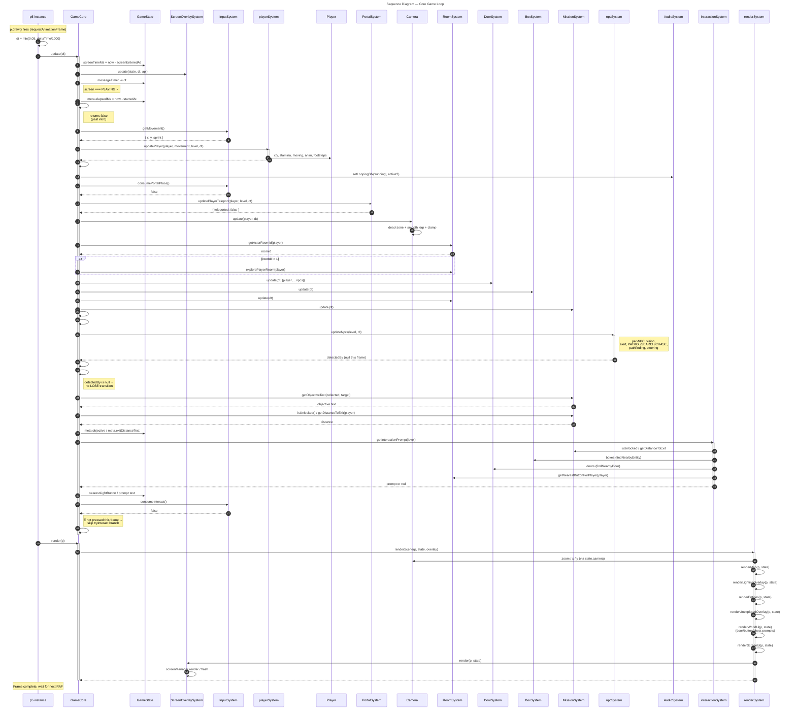
```mermaid
---
title: Sequence Diagram — Core Game Loop
---
sequenceDiagram
    autonumber
    participant p5 as p5 instance
    participant GC as GameCore
    participant GS as GameState
    participant Overlay as ScreenOverlaySystem
    participant Input as InputSystem
    participant PlayerSys as playerSystem
    participant Player
    participant Portal as PortalSystem
    participant Cam as Camera
    participant Room as RoomSystem
    participant Door as DoorSystem
    participant "Box" as BoxSystem
    participant Mission as MissionSystem
    participant NPCSys as npcSystem
    participant Audio as AudioSystem
    participant Interact as interactionSystem
    participant Render as renderSystem

    Note over p5: p.draw() fires (requestAnimationFrame)

    p5->>p5: dt = min(0.05, deltaTime/1000)
    p5->>GC: update(dt)
    activate GC

    GC->>GS: screenTimeMs = now - screenEnteredAt
    GC->>Overlay: update(state, dt, api)
    GC->>GS: messageTimer -= dt
    Note right of GC: screen === PLAYING ✓
    GC->>GS: meta.elapsedMs = now - startedAt

    GC->>GC: #updateIntroAnimation(dt)
    Note right of GC: returns false<br/>(past intro)

    GC->>Input: getMovement()
    Input-->>GC: { x, y, sprint }

    GC->>PlayerSys: updatePlayer(player, movement, level, dt)
    activate PlayerSys
    PlayerSys->>Player: x/y, stamina, moving, anim, footsteps
    PlayerSys-->>GC: 
    deactivate PlayerSys

    GC->>GC: #syncRunningSfx(movement, player)
    GC->>Audio: setLoopingSfx('running', active?)

    GC->>Input: consumePortalPlace()
    Input-->>GC: false
    GC->>Portal: updatePlayerTeleport(player, level, dt)
    Portal-->>GC: { teleported: false }

    GC->>Cam: update(player, dt)
    Cam->>Cam: dead-zone + smooth lerp + clamp

    GC->>Room: getActorRoomId(player)
    Room-->>GC: roomId
    alt roomId > 1
        GC->>Room: explorePlayerRoom(player)
    end

    GC->>Door: update(dt, [player, ...npcs])
    GC->>"Box": update(dt)
    GC->>Room: update(dt)
    GC->>Mission: update(dt)

    GC->>GC: #snapshotDoorStates(level)
    GC->>GC: #snapshotRoomLightStates(level)

    GC->>NPCSys: updateNpcs(level, dt)
    activate NPCSys
    Note right of NPCSys: per-NPC: vision,<br/>alert, PATROL/SEARCH/CHASE,<br/>pathfinding, steering
    NPCSys-->>GC: detectedBy (null this frame)
    deactivate NPCSys

    GC->>GC: #playAlertOnNewNpcChase(level)
    GC->>GC: #playEnemyWorldInteractionSfx(before, before)
    Note right of GC: detectedBy is null →<br/>no LOSE transition

    GC->>Mission: getObjectiveText(collected, target)
    Mission-->>GC: objective text
    GC->>Mission: isUnlocked() / getDistanceToExit(player)
    Mission-->>GC: distance
    GC->>GS: meta.objective / meta.exitDistanceText

    GC->>Interact: getInteractionPrompt(level)
    activate Interact
    Interact->>Mission: isUnlocked / getDistanceToExit
    Interact->>"Box": boxes (findNearbyEntity)
    Interact->>Door: doors (findNearbyDoor)
    Interact->>Room: getNearestButtonForPlayer(player)
    Interact-->>GC: prompt or null
    deactivate Interact
    GC->>GS: nearestLightButton / prompt text

    GC->>Input: consumeInteract()
    Input-->>GC: false
    Note right of GC: E not pressed this frame →<br/>skip tryInteract branch

    GC->>GC: #syncHud(dt)
    deactivate GC

    p5->>GC: render(p)
    activate GC
    GC->>Render: renderScene(p, state, overlay)
    activate Render
    Render->>Cam: zoom / x / y (via state.camera)
    Render->>Render: renderMap(p, state)
    Render->>Render: renderLightingOverlay(p, state)
    Render->>Render: renderEntities(p, state)
    Render->>Render: renderUnexploredOverlay(p, state)
    Render->>Render: renderWorldUi(p, state)<br/>(door/button/chest prompts)
    Render->>Render: renderScreenUi(p, state)
    Render->>Overlay: render(p, state)
    Overlay->>Overlay: screenManager render / flash
    Render-->>GC: 
    deactivate Render
    deactivate GC

    Note over p5: Frame complete, wait for next RAF
```

Figure 4: Game Loop Sequence Diagram

Figure 4 below captures how the core game loop functions in our project. The loop begins when p5's draw callback fires, which then causes GameCore.update(dt) to drive each subsystem in a fixed order, ending with render(p) handing the p5 instance to the render system. The ordering of each subsystem matters because several subsystems read state written by earlier ones. For example, MissionSystem checks the player's position after playerSystem has moved them, and the interactionSystem checks door, box, and button states after DoorSystem and RoomSystem have triggered. This rigid approach keeps the game determinisitic and free of inter-system race conditions and makes adding new systems simple. For any new system to be added, we need to only find the right point in the sequence to insert it.

## 4.4 NPC State Machine

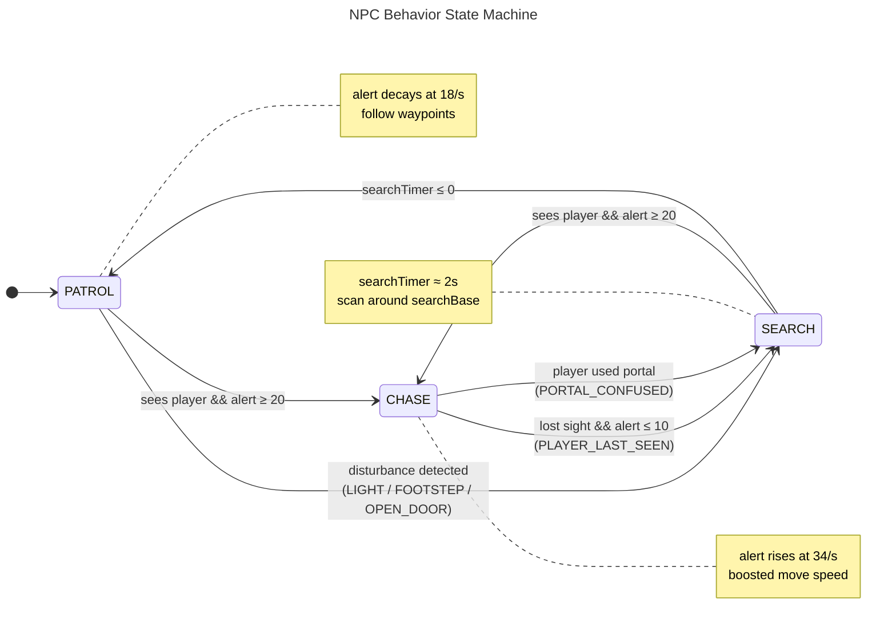
```mermaid
---
title: NPC Behavior State Machine
---
stateDiagram-v2
    direction LR
    [*] --> PATROL

    PATROL --> CHASE : sees player && alert ≥ 20
    PATROL --> SEARCH : disturbance detected<br/>(LIGHT / FOOTSTEP / OPEN_DOOR)

    SEARCH --> CHASE : sees player && alert ≥ 20<br/>
    SEARCH --> PATROL : searchTimer ≤ 0

    CHASE --> SEARCH : lost sight && alert ≤ 10<br/>(PLAYER_LAST_SEEN)
    CHASE --> SEARCH : player used portal<br/>(PORTAL_CONFUSED)

    note right of PATROL
        alert decays at 18/s
        follow waypoints
    end note

    note left of SEARCH
        searchTimer ≈ 2s
        scan around searchBase
    end note

    note right of CHASE
        alert rises at 34/s
        boosted move speed
    end note
```

Figure 5: NPC State Machine

The most complex behavior subsystem in our project is the guard AI, which was modelled as a three-state finite-state machine which lives in npcStateMachine.js. Guards start in a PATROL state and raise their alertLevel (0-100) at 34 per second while the player is in their field of view, decaying at 18 per second otherwise. Crossing the chase threshold (20) with the player still in sight triggers CHASE. Once players break line of sight by hiding behind objects, outrunning guards, or using portals, alert level drops. Once alert level hits 10 or less, guards enter a SEARCH state, scanning their surroundings for 2 seconds. 

PATROL can also be interrupted directly into SEARCH in 3 different ways. Players can toggle light switches off or leave a door open along the guards patrol route to transition guards into SEARCH. Guards who see footsteps left behind by sprinting players will also enter a SEARCH state briefly. Each of these is tagged with a search reason so that guards know where to investigate. For example, turning a light off will cause the guard to move towards the light switch and search the area near the switch. Players who escape chasing guards through a portal will cause the guards to enter into a short confused state at the portal's origin, which provides players with an additional tactic on top of running, hiding, and turning off lights.

# 5. Implementation

- 15% ~750 words

- Describe implementation of your game, in particular highlighting the TWO areas of *technical challenge* in developing your game.

During the development process, the guard AI's movement and decision making and the map rendering system stood out as the greatest technical challenges. The development and implementation of each system is described in further detail below.

## 5.1 Challenge 1: NPC Pursuit AI

Key to developing the kind of game we wanted was to build an NPC movement system that would reliably chase the player through multi-room environments and respond to player behavior. This meant balancing four competing goals at the same time:

1. Robustness (never getting stuck in narrow corridors or around corners)
2. Responsiveness (continuously track the player)
3. Naturalness (avoid jitter, oscillation, and robotic motion)
4. Performance (staying close to 60 FPS in a single-threaded JS game loop)

The guard's decision making has to plan paths in real time. In PATROL and SEARCH (see _Figure 5_), it must find fast, believable routes from any point on the map back to a known waypoint. In CHASE, it must react within a handful of frames as the player changes direction. After reviewing several tracking approaches, we chose **A\* pathfinding** as our global planner because it is a well-established algorithm for shortest-path search on graphs. To make the movement more natural in dynamic environments, we added an intelligent waypoint-skipping mechanism which scans the path backwards from the end and jumps directly to the furthest waypoint an NPC can reach.

This approach was not enough as the guards would still behave clumsily in maps with many obstacles. NPCs would often get stuck in corners and if an obstacle was between them and the player, they could not go around the obstacle to continue the chase. Returning to our research, we adopted a context-based steering approach. The idea is to cast 12 equally-spaced rays around the NPC and then score each direction based on 1) how well it aligns with the desired direction and 2) how far it is from nearby obstacles. Directions that are towards the target and far from obstacles receive higher scores. A weighted sum of all valid direction vectors is then computed and normalized to obtain the final movement direction that naturally avoids obstacles while still heading toward the player. 

These two strategies resulted in guards that could weave through obstacles in a way that appeared human. However, guards would occasionally still jitter near tight corners as the AI constantly recalculated the best direction. To avoid this, we added three supporting mechanisms:

1. A three-tier progressive recovery system to prevent the NPC from getting permanently stuck
2. A smooth-facing algorithm to reduce jitter in rotation
3. A box-swept traversal check to handle cases where a straight line is clear for the ray but not for the actual body

With this combined approach, we achieved NPC behavior that felt close to a human player, helping to strengthen our game's core stealth experience.

## 5.2 Challenge 2: Map Rendering

Our second challenge was map rendering. Initially, we planned on placing all content on a single layer like a jigsaw puzzle but found out that this approach ran counter to the principle of low coupling, resulting in interdependencies between several elements. As a result, we designed a layer rendering architecture where each layer is rendered independently, with transformation states managed with p5's push()/pop() methods. Although we started development with native HTML Canvas, we quickly realized that p5.js was necessary for the project, and after consulting our instructors, we abandoned the original plan and made the switch to p5.

Dynamic parsing of map tiles presented other challenges during this process, including:

- The rendering order of tiled layers
- How to calibrate the positions of images with varying pixel sizes (larger than 16x16 pixels)
- How to implement flipping and mirroring for graphics in map design

We eventually sorted out our approach and finalized the correct sequential rendering logic. Large images were cropped and we used the 16x16 pixel area in the bottom-left corner as anchor points. Flipping and mirroring was implemented through a combination of custom algorithms and pre-flipped tileset variants. With these solutions in place, we successfully implemented the map tile parsing module.

# 6. Evaluation

## 6.1 Qualitative

We chose a think-aloud usability protocol as our qualitative method early on in the development process, primarily because our game's difficulty depends on its controls and stealth mechanics. This approach allowed us to see if the player encountered any friction in the moment, rather than relying on them remembering and articulating their difficulties in a post-session questionnaire. Participants were asked to narrate their thoughts while playing an early build of the game, and facilitators from our team recorded observations without intervening. We grouped the resulting observations into four themes, shown in _Figure 6_ below.

  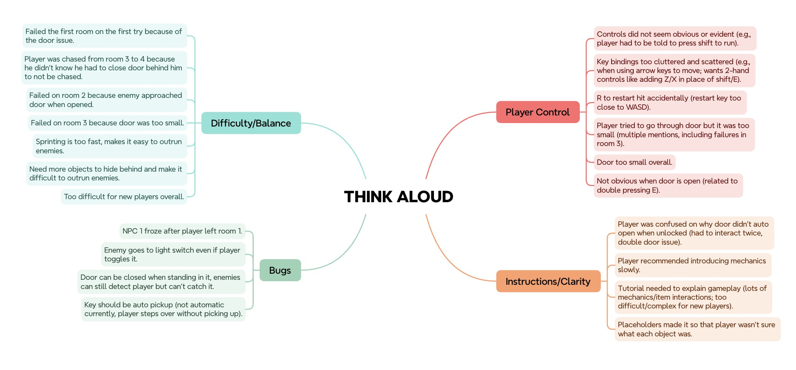

Figure 6: Think Aloud Summary

Several recurring issues arose across participants that warranted reconsideration. In response we made the following changes to the build:

- Doors were widened and their interaction was simplified
- Sprinting speed was lowered to increase difficulty
- Additional cover was provided so that breaking line of sight became a viable recovery tactic
- Controls were reworked to include arrow keys as well as WASD, and the HUD was reworked to more prominently display key bindings
- A tutorial screen was added to introduce mechanics
- A bug where players could close a door while standing in the frame was fixed

  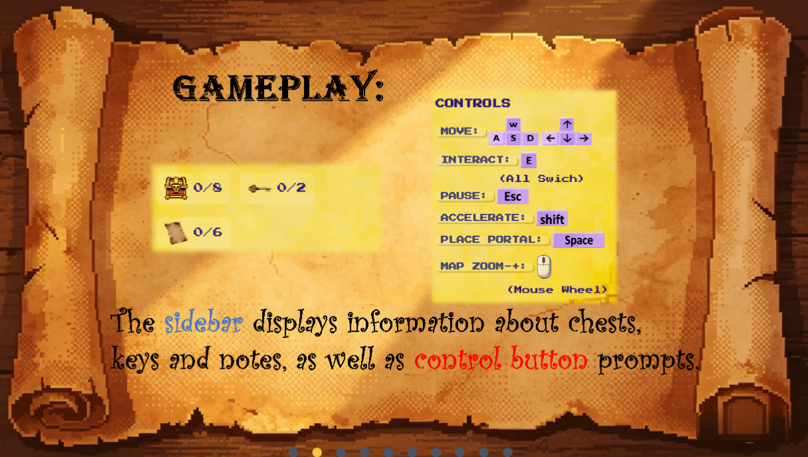

Tutorial Screen

## 6.2 Quantitative 

We employed the System Usability Scale (SUS) as our quantitative method, a standardized 10-item Likert instrument that gives a single 0-100 usability score. SUS was a good fit because it is short enough to complete after a play session, it benchmarks against an established industry average of 68, and it does not require prior gaming experience.

Procedure：Ten participants were split into two groups of five to control for learning effects.
- Group A (P1–P5): played Level 1 (Easy) then Level 2 (Medium)
- Group B (P6–P10): played Level 2 (Medium) then Level 1 (Easy)
- Each participant completed the SUS form after each level, producing both an L1 and L2 score

    
| **Participant** | **SUS L1** | **SUS L2** | **Difference** |
| --------------- | ---------- | ---------- | -------------- |
| P1              | 67.5       | 72.5       | 5.0            |
| P2              | 77.5       | 80.0       | 2.5            |
| P3              | 65.0       | 80.0       | 15.0           |
| P4              | 72.5       | 85.0       | 12.5           |
| P5              | 70.0       | 70.0       | 0.0            |
| P6              | 80.0       | 65.0       | -15.0          |
| P7              | 62.5       | 57.5       | -5.0           |
| P8              | 82.5       | 80.0       | -2.5           |
| P9              | 70.0       | 57.5       | -12.5          |
| P10             | 90.0       | 87.5       | -2.5           |
| **Average**     | **73.75**  | **73.50**  | **-0.25**      |

Figure 7: SUS Data Overview

**Graphical Representation**

  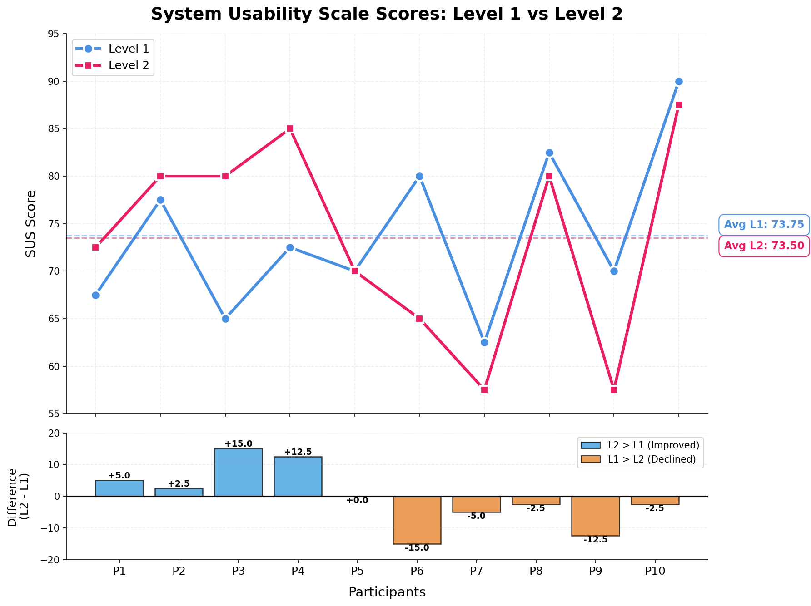

Figure 8: SUS Scores with Differences

**Statistical Analysis**

The analysis yielded W = 21.5 with p = 0.9961 (p > 0.05), indicating no significant distributional differences between game levels.
Both levels demonstrated functionally equivalent usability performance: Level 1 (Mean = 73.75, SD = 8.60) and Level 2 (Mean = 73.50, SD = 10.81), with a negligible mean difference of 0.25 points and trivial effect size (r = 0.002).

**Interpretation**

These results ran counter to our expectation that a second, more advanced level would earn higher usability ratings due to increased familiarity. We identified two possible factors for this:

- The difficulty gap between the two levels may have been too narrow to produce different interaction demands.
- The deliberately consistent UI layout and controls across levels facilitated knowledge transfer from L1 to L2.

If players do not perceive a meaningfully different gameplay challenge between levels, the interface demands should remain roughly equal and produce near-identical scores, as reflected in our results.
Both levels scored above the acceptable SUS benchmark of 68, confirming that users found the interface accessible regardless of level. Neither condition reached the "Excellent" threshold of 85, indicating room for improvement in interface responsiveness and feedback clarity. Our next design iteration should therefore differentiate levels more through stealth and routing demands rather than relying on larger maps or more guards. Additionally, we should sharpen feedback cues to move our scores closer to the excellent range.

## 6.3 Testing

Along with the user studies above, we ran a structured testing program to validate the code itself. The testing documentation lives under testing/ in the repository and is summarised below. Full row-by-row execution records are kept in general_test_table.xlsx and npc_ep_test_cases.xlsx.

**Methodology**. We applied four testing techniques. 

| **Technique** | **Number of Cases** | **Systems Tested** |
| --------------- | ---------- | ---------- | 
| Black-box testing          | 51       | Used for player-visible behaviour. This covered launch flow, screen transitions, gameplay rendering, controls, audio, interactions, objectives, endings, deployment, and game-state flow. | 
| White-box testing          | 10       | Used for selected internal logic. These tests checked state routing, audio sync, layout helpers, overlay rendering guards, interaction prompt priority, door state transitions, mission unlock logic, and input reset behaviour. | 
| Boundary-value testing     | 10       | Used for edge cases. These included first input, rapid input, small and large browser windows, loading delay, hold thresholds, and repeated door interaction. | 
| Equivalence partitioning   | 7        | Used for NPC state transitions. NPC state behaviour was divided into representative classes based on current NPC state, player visibility, alert level, and trigger/completion condition. | 

**Results**. The final result was 78/78 cases passing with 0 open bugs. Two defects were found during testing and were fixed before submission: B01, a high-severity UI scaling failure when the browser window was resized, and B02, a tutorial-exit bug where pressing E at the end of the story-mode tutorial returned the player to the start page. The failing test rows were retested after each fix and now record Pass, while the bug log keeps the historical defect record for traceability. 

# 7. Process 

- 15% ~750 words

- Teamwork. How did you work together, what tools and methods did you use? Did you define team roles? Reflection on how you worked together. Be honest, we want to hear about what didn't work as well as what did work, and importantly how your team adapted throughout the project.

## 7.1 Team Roles

Our team divided responsibilities early on based on each member's prior interests and experience. The full breakdown is shown in _Table 1_ above. Defining roles early gave us a starting point and reduced confusion over ownership. In practice, responsibilities still overlapped so our workflow was more collaborative than the role list suggests.

## 7.2 Methodology

We initially planned to follow a Scrum-style agile methodology with fixed-length sprints, sprint backlogs, standups, reviews, and retrospectives. In practice, we ran two sprints of uneven length (two weeks and three weeks) before the formal process fell away. Most of the team had not worked in an agile/Scrum context before, and with the pressure of the project timeline, we moved toward lighter-weight coordination that the whole team could participate in and feel comfortable with. 

User stories were translated into issues and placed on our Kanban board during the first sprint, prioritizing tasks that other systems depended on. Unfinished tasks from sprint one and additional user stories from our sprint backlog were added to sprint two. Neither sprint was executed strictly, and as a team we were more successful at tracking what needed to be done rather than enforcing when it had to be done. 

## 7.3 Communication and Meeting Cadence

  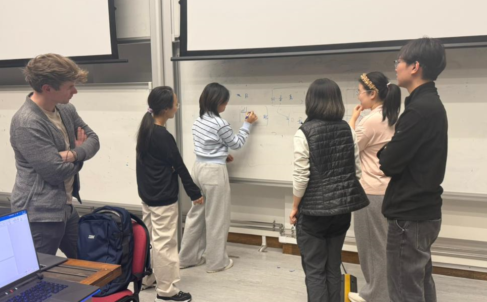

Week 3 Monday Meeting

Communication was one of the more successful parts of our process. We met three times a week after class to share progress, discuss blockers, and decide what each person should complete before the next meeting. These meetings were not formal Scrum standups though they did share some similarities, and most importantly, kept the team aligned. 

Outside meetings, we used WhatsApp for questions, receiving feedback, and providing progress updates. It worked well for us because it was immediate, familiar, and easy to engage with. Although our process frameworks were inconsistent, our communication habits were reliable, which helped us compensate for weaknesses elsewhere.

## 7.4 Tools and Documentation

Google Drive became the home for everything that wasn't code, including meeting notes, weekly updates, and supporting documentation. We developed an intuitive and organized folder structure which made it easier to find the latest version of documents and reduced confusion. 

  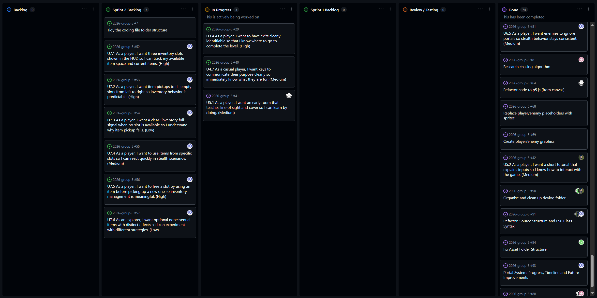

Kanban Board at Project End

GitHub held our codebase and our Kanban board, and after an initial adjustment period (discussed below), it became the source of all files. We authored a GitHub contributing guide early in the project, covering branching conventions, commit message format, PR etiquette, and a definition of done. Although the guide was not strictly followed, it did establish a set of expectations that the team eventually adapted in our development process.

## 7.5 The Learning Phase

Early in the project, most development happened through live coding sessions with extended voice calls rather than through the repository. This strategy had some advantages, like quick feedback, team-based problem solving, and strengthening team cohesion, but its limitations became clear as our codebase grew. Contributions were hard to attribute to each individual and integration happened in large bulk commits instead of small, reviewable increments. The repo's history did not reflect the pace at which the work was actually being done, which reduced the value of GitHub as a development tool. 

After speaking with our instructors, we moved development and all of our documentation to our repository. This explains why parts of the repo’s history show work arriving in larger batches, as we were migrating from our earlier approach. Over time, smaller and more granular commits became the norm as we adapted to a more conventional workflow. 

We now acknowledge that it would have been easier to start that way, but experiencing the problems first-hand gave everyone an understanding of why git-based workflows exist. That lesson is likely to stay with us more clearly than if we had followed the correct process from day one.

Weekly Progress

| Week       | Description                                                                                                                                                                                                                 |
| ---------- | --------------------------------------------------------------------------------------------------------------------------------------------------------------------------------------------------------------------------- |
| Week 1     | Initial group discussions and idea exploration; project proposal, GitHub template, and Google Drive were set up; early research on similar games, art direction, and gameplay inspiration was conducted.                    |
| Week 2     | Ownership distribution and gameplay direction were discussed; workflow planning, Kanban setup, and meeting documentation were developed; early design work on mechanics, art concepts, and prototype ideas was carried out. |
| Week 3     | The core game loop was defined; user stories were expanded; detailed gameplay and coding design documents were produced; prototype materials were uploaded and implementation planning became more structured.              |
| Week 4     | The team reviewed whether to change the original game idea but decided to keep it; work continued on documentation, coding references, asset planning, and system design; some role responsibilities became clearer.        |
| Week 5     | Initial production work began, including game asset creation, UX/UI materials, diagrams, and screen-related content; technical preparation also continued through module design and contribution guidelines.                |
| Week 6     | Coding started; the underlying architecture and main game loop began to be built; UX/UI asset creation, map generation, and supporting evaluation materials also progressed.                                                |
| Week 7     | The group focused on integration and gameplay systems, including scene-related code, NPC patrol and alert systems, stamina mechanics, animations, sprites, and maps; onsite evaluation tasks were also carried out.         |
| Week 8     | Work continued on asset generation, refactoring, game integration, visual effects, and statistical evaluation; sprint roles and task distribution were also reviewed.                                                       |
| Week 9     | The project shifted toward testing, with preparation of testing documents, procedures, and supporting materials, while some technical and animation work also continued.                                                    |
| Week 10–12 | Progress slowed due to spring break and celebration week, but work still continued on screen creation, endings development, portal implementation, animation, and report support.                                           |
| Week 13    | The team focused on final feature completion, including the notes feature, on-screen notifications, tutorial creation, testing completion, bug fixing, and music and sound effects.                                         |
| Week 14    | Final work centred on report writing, remaining fixes and improvements, video production, and overall project wrap-up.                                                                                                      |

## 7.6 Reflection

The process side of the project is where we learned the most. As a team we celebrate: 

- Our consistent meeting schedule
- Strong group communication
- Clear shared documentation
- Successfully shipping a complete game

At the same time, we recognise several weaknesses in how we worked:

- Our adoption of agile was limited and inconsistent
- Our contributing guide and sprint boards were set up but not followed rigorously
- Our GitHub workflow developed gradually instead of being established properly from the start

Process Changes Over Time

| Category        | Before                          | Now  |
| --------------- | ------------------------------------------------------------------------------------------------------------------------------------------------------------------------------------------------- | ------------------------------------------------------------------------------------------------------------------------------------------------------------------------------------------- |
| Workflow        | There were differences in preferred working styles: some preferred short meetings for updates, while others preferred onsite meetings to discuss ideas and work directly on the project together. | We hold regular meetings for short updates with the whole group, as well as one-to-one meetings when developing or collaborating on the same module.                                        |
| Workflow        | In the first few weeks, we worked mainly through Google Drive and private chats, so some contributions and progress were harder to track.                                                         | Google Drive is now used only for visualization, and no further updates are made there. All changes are now made and tracked through GitHub.                                                |
| Documentation   | Some early decisions and contributions were discussed informally, which made them harder to trace later.                                                                                          | Important decisions, meeting notes, and task changes are now documented more consistently to improve transparency.                                                                          |
| Task Allocation | Responsibilities were not always clearly defined, and some members had different expectations about their roles.                                                                                  | Now each member’s responsibilities are documented to make contributions easier to track. Also we will talk about how to split and rotate tasks so everybody can touch a little bit of code. |

These issues did not prevent us from completing the project, but they made parts of the process less efficient than they should have been. The most important outcome is that we adapted as the project progressed and now have a clearer understanding of how we would organise a similar project in future. In particular, we would establish a repository-centred workflow earlier, keep sprint structures simpler and more realistic, and maintain the strong communication habits that worked well for us throughout. 

# 8. Sustainability, Ethics, and Accessibility

- 10%, ~750 words

- Evidence of the impact of your game across the environment + 2 of the following: social, economic, technical, individual

## 8.1 Sustainability Awareness Framework (SusAF)

Our reflection on our game's wider impact focuses on the three dimensions that our design decisions impacted the most: environmental, social, and individual.

### Environmental

### Social

On the inclusiveness and diversity front, our initial approach was to make a game that was playable with one hand to support one-handed players. The original control structure is shown below. However, we also received feedback that this layout felt too clustered for many players, so we added the ability to control the character with the arrow keys. In future iterations, we would develop a similar one hand layout on the right side of the keyboard to accommodate multiple preferences. 

  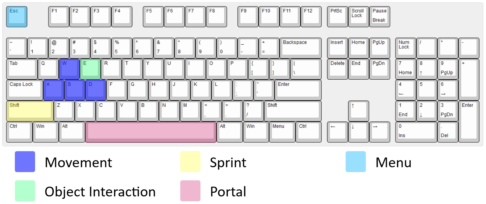

Control Layout

A tutorial mode was also added after usability testing to introduce mechanics gradually rather than assuming prior gaming experience. Game text was tested against WCAG contrast ratio guidelines using WebAIM's contrast checker and passed both AA and AAA tests.

We do acknowledge that the current build does not have a colorblind-safe mode, no option to change text size, and no option to resize the UI, and these are clear accessibility extensions for future versions of the game.

### Individual

On the individual dimension, we intentionally built the game to be playable without collecting personal data of any kind. Our game does not require an account, collects no analytics, does not use third-party tracking scripts, cookies, or persistent storage. A player's session is entirely local to their browser and does not leave any trace on our end once the tab is closed. This was an intentional decision we made early on as we did not find any compelling gameplay reason to introduce data collection, particularly for a student project.

  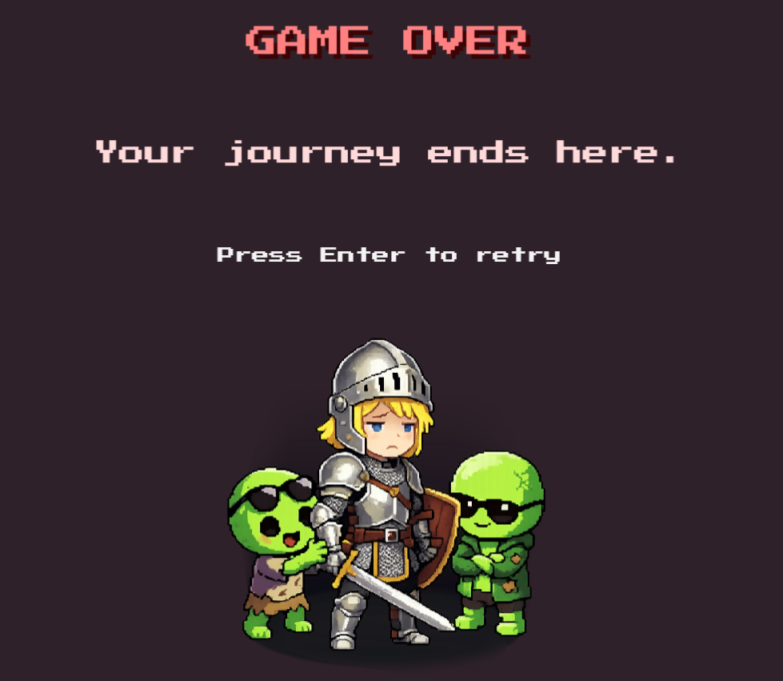

Game Over Screen

Player agency is supported in many practical ways. The game can be paused at any time, exited to the title screen mid-level, or restarted without penalty. Failure states are gentle and simply return the player to a lose screen with an option to try again. Our game does not introduce scores, streaks, or social-comparison mechanics that could potentially encourage addictive or compulsive play. Through these choices, user privacy is preserved and our model supports casual, uncommitted play without forcing long-term engagement.

# 9. Conclusion

- 10% ~500 words

- Reflect on the project as a whole. Lessons learnt. Reflect on challenges. Future work, describe both immediate next steps for your current game and also what you would potentially do if you had chance to develop a sequel.

## 9.1 Reflection

Building **Escape: Oh Dear Dragon!** gave our team our first experience of taking a concept and turning it into a playable game, along with a solid idea of what software engineering in a team looks like. We accomplished what we set out to do and created a 2D stealth game with a neon-cyberpunk aesthetic, responsive guard AI, and a story twist that subverts the established "rescue the princess" trope. As a team, we think the game is enjoyable to play and tells a fun, short story, and of that we are proud.

On the technical side, we learned that a stealth game is an AI problem disguised as a level design problem. Every decision about levels, cover objects, and object interactions came down to how the guards interacted with the player and the environment. Getting the NPC state machine and pathfinding algorithm to cooperate was the most challenging and time consuming task, but also one that was most rewarded, as it was the core game mechanic on which everything else hinged.

On the process side, our attempt to adopt Scrum formally was less successful than the Kanban and frequent meetings approach we utilized early on. Our consistent communication and strong documentation allowed us to overcome the challenges that came from not using any formal version control until our project grew in size. The git workflow we eventually settled into was one we arrived at through iteration, and was a valuable learning experience for our team. 

## 9.2 Next Steps for Escape: Oh Dear Dragon!

The feature we were unable to implement is a consumable item system that we set as a goal in case we finished development ahead of schedule. We planned on implementing invisibility cloaks, guard disguises, and stun bombs that would give the player a more versatile toolkit for handling enemy encounters. 

Some other ideas we have for enhancing the game include:
- Extending the story into gameplay by moving the princess and the dragon from cutscene characters to encountered NPCs
- A randomly-generated map mode
- Variability in guard behaviors
- Note-driven side objectives
- Increased focus on accessibility (colorblind-safe colors, remappable controls, resizable UI)

## 9.3 Sequel Ideas

The story ends with the hero freeing the dragon and leaving the princess in the ruins of the dungeon, having foiled her plans. This narrative lends itself to a sequel as the princess seeks revenge by capturing the hero and imprisoning him. The player would take the role of the hero escaping the princess's dungeon, preserving the game's core stealth mechanic while inverting the power dynamic. The sequel would also be a good place to attempt a 3D game and potentially experiment with co-op multiplayer.

  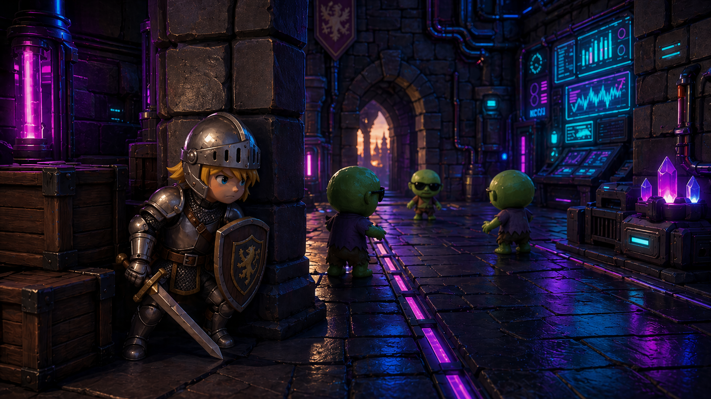  

3D Sequel Mockup

## 9.4 Closing Thoughts

Ultimately, we appreciate the opportunity to collaborate as a team, learn from each other, and gain experience with the software engineering process from ideation to a working product. We learned many lessons throughout this project and are excited to take this knowledge with us into the summer project and eventually, our careers. 

    

Onwards to new adventures!

# 10. Contribution Statement

| Member Name   | Weight |
| ------------- | ------ |
| Yan Cui       | 1/6    |
| Yawen Zhang   | 1/6    |
| Hanqing Zhang | 1/6    |
| Haris Kovac   | 1/6    |
| Frida Chen    | 1/6    |
| Jinni Li      | 1/6    |

# 11. AI Statement

- Summarize your team's use of AI so we know where to give you credit for work done.

### Additional Marks

You can delete this section in your own repo, it's just here for information. in addition to the marks above, we will be marking you on the following two points:

- **Quality** of report writing, presentation, use of figures and visual material (5% of report grade) 
  - Please write in a clear concise manner suitable for an interested layperson. Write as if this repo was publicly available.
- **Documentation** of code (5% of report grade)
  - Organise your code so that it could easily be picked up by another team in the future and developed further.
  - Is your repo clearly organised? Is code well commented throughout?
