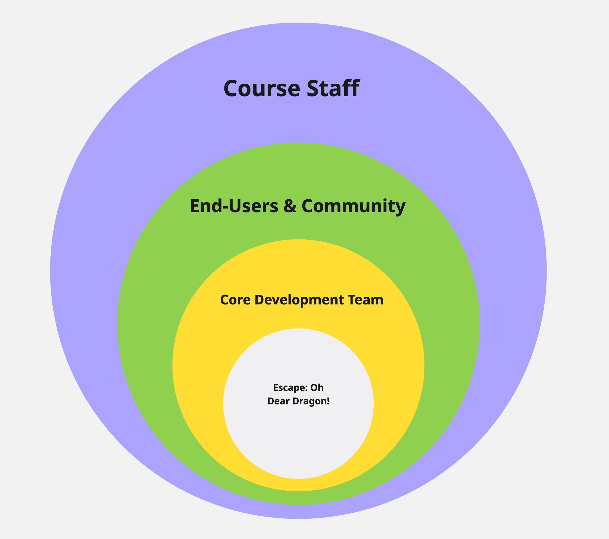

# 2026-group-5

🎮 [Click this link to play our game.](https://uob-comsm0166.github.io/2026-group-5/docs/game%20-%20v5/index.html)   
🎬 [Click this link to watch our game video.]()   
📋 [This is the link to our Kanban board.]()

---

# Table of Contents

1. [Introduction](#1-introduction)
2. [Development Team](#2-development-team)
3. [Requirements](#3-requirements)
4. [Design](#4-design)
5. [Implementation](#5-implementation)
6. [Evaluation](#6-evaluation)
7. [Process](#7-process)
8. [Conclusion](#8-conclusion)
9. [Contribution Statement](#9-contribution-statement)

---

# 1. Introduction

**Escape: Oh Dear Dragon!** is a 2D top-down stealth game with a neon-cyberpunk castle aesthetic. Our brave hero sneaks through the castle's many chambers, each packed with patrolling guards, using stealth and subterfuge to reach the next level, and hopefully find the princess. Oh and portals...did we mention the portals? Yeah, we've got those too!

Our game is inspired by Invisible Inc. and the Thief and Dishonored series for their stealth-focused gameplay and emphasis on problem solving over direct confrontation. Players must study patrol routes and sneak through the castle, avoiding being seen (or heard), unless they want to become a snack for the stylish, sunglasses-wearing dragon. 

The twist mechanic was inspired by Valve's Portal series. Players can place linked portals to quickly and strategically navigate the castle's interior, bypass dangerous chokepoints, or recover from risky plays. This mechanic is built directly into our game's core stealth navigation, creating constant tactical choices between planning safe routes and improvising under pressure. 

The story begins as an all too familiar fantasy trope - rescue the princess from the big bad dragon. However, we gradually subvert that premise as the player uncovers an uncomfortable truth: the kingdom's chaos may be an unintended consequence of one unbelievably un-self-aware hero.

# 2. Development Team

| Person        | Email                    | GitHub                    | Roles                                     |
| ------------- | ------------------------ | ------------------------- | ----------------------------------------- | 
| Tracy Cui     | sk25619@bristol.ac.uk    | @Tracy-fuyao              | Architecture & Integration                | 
| Yawen Zhang   | vm25514@bristol.ac.uk    | @joan9yawen-source        | UI/UX                                     | 
| Hanqing Zhang | sv25099@bristol.ac.uk    | @zhq1374547005-UOB        | Game Flow, Level Design & Gameplay Vision | 
| Haris Kovac   | yw25220@bristol.ac.uk    | @hariskovac               | Documentation & Scrum Master              |
| Frida Chen    | ba25966@bristol.ac.uk    | @fridachen1127            | Evaluation, Github & Research             |
| Jinni Li      | ra25313@bristol.ac.uk    | @Jinni-Li                 | UI/UX, Testing                            | 

# 3. Requirements 

- 15% ~750 words
- Early stages design. Ideation process. How did you decide as a team what to develop? Use case diagrams, user stories.

## Stakeholders

The following figure shows our Stakeholder Onion Model, with layers indicated in the image.

- Core Development Team
  - Design, implementation, testing, evaluation and documentation
- End-Users & Community
  - Classmates & peer reviewers: provide usability and feature feedback to guide iterations
  - Online players via GitHub Pages: use the deployed version and report issues or suggestions
- Course Staff
  - Instructors & Teaching Assistants: define requirements and grading criteria

# 4. Design

- 15% ~750 words 
- System architecture. Class diagrams, behavioural diagrams.

# 5. Implementation

- 15% ~750 words

- Describe implementation of your game, in particular highlighting the TWO areas of *technical challenge* in developing your game. 

# 6. Evaluation

## Qualitative

Changes made:

## Quantitative 

# 7. Process 

- 15% ~750 words

- Teamwork. How did you work together, what tools and methods did you use? Did you define team roles? Reflection on how you worked together. Be honest, we want to hear about what didn't work as well as what did work, and importantly how your team adapted throughout the project.

# 8. Conclusion

- 10% ~500 words

- Reflect on the project as a whole. Lessons learnt. Reflect on challenges. Future work, describe both immediate next steps for your current game and also what you would potentially do if you had chance to develop a sequel.

# 9. Contribution Statement

- Provide a table of everyone's contribution, which *may* be used to weight individual grades. We expect that the contribution will be split evenly across team-members in most cases. Please let us know as soon as possible if there are any issues with teamwork as soon as they are apparent and we will do our best to help your team work harmoniously together.

### Additional Marks

You can delete this section in your own repo, it's just here for information. in addition to the marks above, we will be marking you on the following two points:

- **Quality** of report writing, presentation, use of figures and visual material (5% of report grade) 
  - Please write in a clear concise manner suitable for an interested layperson. Write as if this repo was publicly available.
- **Documentation** of code (5% of report grade)
  - Organise your code so that it could easily be picked up by another team in the future and developed further.
  - Is your repo clearly organised? Is code well commented throughout?
