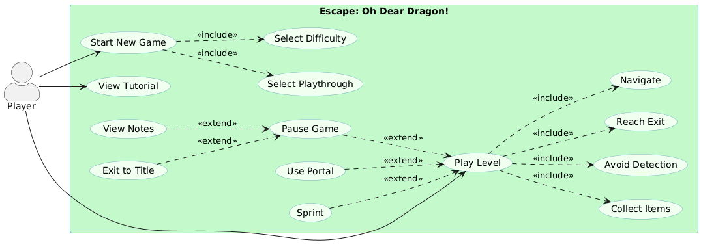
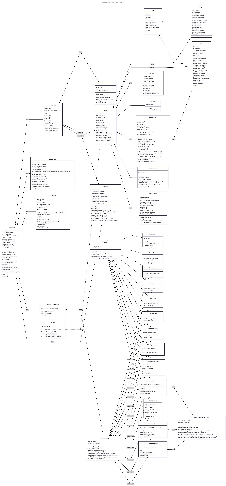
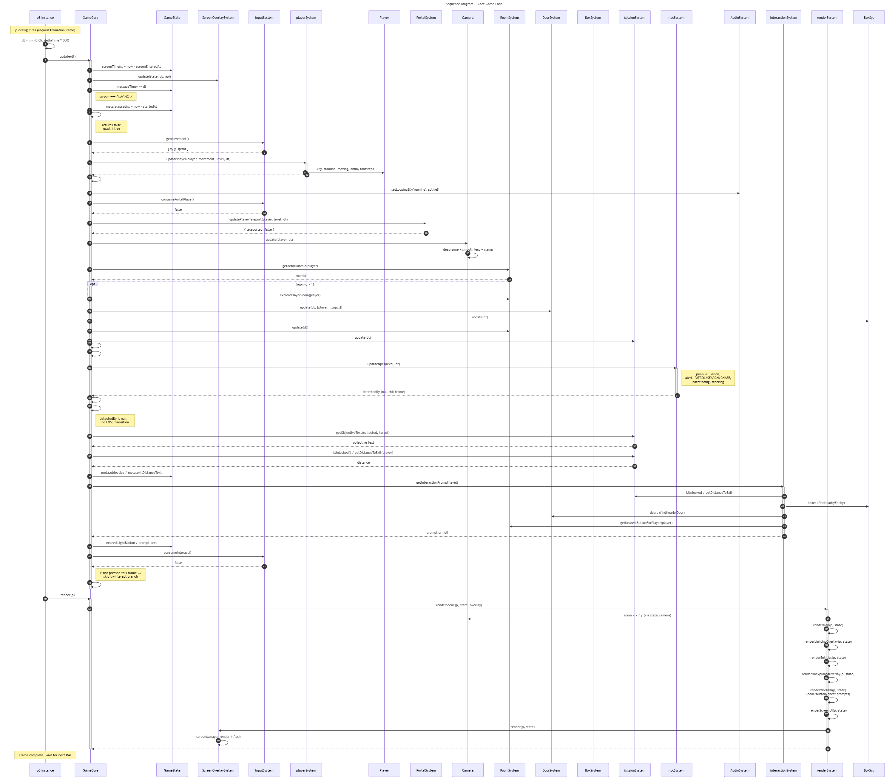
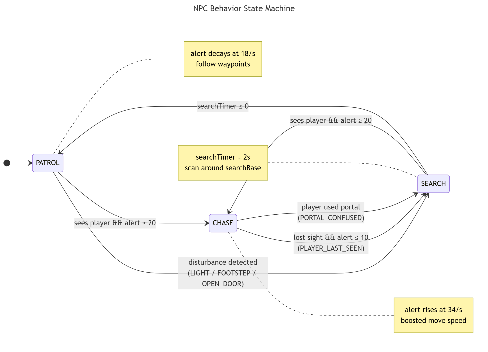

# Escape: Oh Dear Dragon!

# Table of Contents

1. [Introduction](#1-introduction)
2. [Development Team](#2-development-team)
3. [Requirements](#3-requirements)
4. [Design](#4-design)
5. [Implementation](#5-implementation)
6. [Evaluation](#6-evaluation)
7. [Process](#7-process)
8. [Conclusion](#8-conclusion)
9. [Contribution Statement](#9-contribution-statement)

# 1. Introduction

**Escape: Oh Dear Dragon!** is a 2D top-down stealth game with a neon-cyberpunk castle aesthetic. Our brave hero sneaks through the castle's many chambers, each packed with patrolling guards, using stealth and subterfuge to reach the next level, and hopefully find the princess. Oh and portals...did we mention the portals? Yeah, we've got those too!

Our game is inspired by Invisible Inc. and the Thief and Dishonored series for their stealth-focused gameplay and emphasis on problem solving over direct confrontation. Players must study patrol routes and sneak through the castle, avoiding being seen (or heard), unless they want to become a snack for the stylish, sunglasses-wearing dragon. 

The twist mechanic was inspired by Valve's Portal series. Players can place linked portals to quickly and strategically navigate the castle's interior, bypass dangerous chokepoints, or recover from risky plays. This mechanic is built directly into our game's core stealth navigation, creating constant tactical choices between planning safe routes and improvising under pressure. 

The story begins as an all too familiar fantasy trope - rescue the princess from the big bad dragon. However, we gradually subvert that premise as the player uncovers an uncomfortable truth: the kingdom's chaos may be an unintended consequence of one unbelievably un-self-aware hero.

# 2. Development Team

| Person        | Email                    | GitHub                    | Roles                                        |
| ------------- | ------------------------ | ------------------------- | -------------------------------------------- | 
| Tracy Cui     | sk25619@bristol.ac.uk    | @Tracy-fuyao              | Architecture and Integration                 | 
| Yawen Zhang   | vm25514@bristol.ac.uk    | @joan9yawen-source        | UI/UX                                        | 
| Hanqing Zhang | sv25099@bristol.ac.uk    | @zhq1374547005-UOB        | Game Flow, Level Design and Gameplay Vision  | 
| Haris Kovac   | yw25220@bristol.ac.uk    | @hariskovac               | Documentation and Scrum Master               |
| Frida Chen    | ba25966@bristol.ac.uk    | @fridachen1127            | Evaluation, Code Review and Github Workflow  |
| Jinni Li      | ra25313@bristol.ac.uk    | @Jinni-Li                 | UI/UX and Testing                            | 

# 3. Requirements 

- 15% ~750 words
- Early stages design. Ideation process. How did you decide as a team what to develop? Use case diagrams, user stories.

## Ideation
During the ideation process, team members took turns proposing their ideas. Our initial list contained several concepts, but three quickly became the frontrunners: a tactical stealth game, a rogue-like, and a Bomberman clone. The team spent a great deal of time debating on the merits of each idea, considering factors such as difficulty of implementation, originality, player enjoyment, and how excited we were about the concept as developers.

Due to the semester-long nature of the course, the difficulty and time it would take to implement a game became deciding factors. Because of that, we decided that the rogue-like would not be feasible to complete to a satisfactory level given our timeframe. We created paper prototypes for the remaining two ideas and presented them to classmates.

For the stealth game, we prototyped navigating around rooms, enemy field of view and alert bars, and collecting keys to advance further through the level. For the Bomberman idea, we prototyped map layout, power-ups, enemy behavior, and dropping bombs to destroy blocks and damage enemies, along with portal mechanics from the Portal game. Ultimately, we voted and decided that we would create the stealth game combined with portal mechanics as the twist, allowing the player additional mechanics for avoiding enemies and navigating levels. 

## Stakeholders

The following figure shows our Stakeholder Onion Model, with layers indicated in the image.

Figure 1: Stakeholder Onion Model

The System ring captures direct users of the game (players/playtesters). The Containing System includes those who create, support, and evaluate the product (dev team, teaching staff). The Wider Environment captures university-level constraints and infrastructure.

## Epics and User Stories

We used an epic-driven approach to define our feature scope. Each epic represents a major gameplay system, with user stories capturing specific player needs. These stories were then tracked as GitHub issues to manage implementation and progress.

Our Epics include:
- **Epic 1**: Stealth and Movement
- **Epic 2**: Enemy Visibility and Feedback
- **Epic 3**: Rooms, Doors, and Progression
- **Epic 4**: Keys and Interactables
- **Epic 5**: Challenge and Learning Curve
- **Epic 6**: Portal Mechanics
- **Epic 7**: Inventory and Items
- **Epic 8**: Game Flow and Feedback

Below are the user stories for our first epic, Stealth and Movement. Please see the appendix for the remaining user stories.

**Epic 1: Stealth and Movement**

| Number        | User Story               | Priority                  | 
| ------------- | ------------------------ | ------------------------- | 
| U1.1          | As a player, I want responsive movement so I can position precisely to avoid enemy vision and alert zones.    | High            |
| U1.2          | As a player, I want walls, doors, and solid obstacles to block movement so navigation feels consistent.    | High            |
| U1.3          | As a player, I want obstacles and corners to provide cover so I can avoid line of sight strategically.    | High            |
| U1.4          | As a player, I want to switch between walking and sprinting so that I can trade safety for speed when escaping danger.    | High            |
| U1.5          | As a player, I want sprinting to generate visible/audible noise feedback so I understand when enemies may investigate.    | High            |
| U1.6          | As a player, I want guards to lose me when I successfully break line-of-sight so that stealth feels skill-based.    | High            |
| U1.7          | As a player, I want to fail only when a guard reaches me in a chase so that mistakes feel fair and understandable.    | High            |
| U1.8          | As a player, I want to preview nearby danger (panning camera) so I can scout safely before advancing.    | Medium            |

## Use Case Diagram

To consolidate our user stories into a player-facing view of the system and scope the behavior we planned to implement, we created the use case diagram shown below. 

Figure 2: Use Case Diagram

The Player has three entry points into the system: starting a new game, viewing the tutorial, or playing a level. Starting a new game _includes_ selecting a playthrough and a difficulty as both are required to load a level. Playing a level _includes_ navigating the map, avoiding detection, collecting items in chests, and reaching the exit. These four are part of the core loop and can't be opted out of. Sprinting, using portals, or pausing the game are modelled as _extends_ relationships because they are optional. The player can complete a level only by walking and using the base controls. Pausing the game _extends_ itself further into viewing collected story notes or exiting to the title screen. The full use case specification for the Play Level use case is given below.

| Field         | Specification            | 
| ------------- | ------------------------ | 
| Actor         | Player                   | 
| Pre-conditions               | The player has selected a playthrough variant and a difficulty level, the corresponding map has loaded, and the intro cutscene has finished    | 
| Basic Flow - Goal            | Collect every chest in the level, then reach the exit door without being caught by a guard.    | 
| Basic Flow - Step 1          | Player explores the level, avoiding guards and using movement, sprinting, interaction, and portals as needed.    | 
| Basic Flow - Step 2          | Player opens chests to collect keys and story notes. Opening every chest unlocks the exit door.    | 
| Basic Flow - Step 3          | Player reaches the unlocked exit door and presses E to exit. The win screen is shown.    | 
| Alternative Flow             | A guard detects the player and begins searching or chasing.            |
| Recovery Step                | Player breaks line of sight using walls, doors, or a portal before the guard reaches them. The guard searches the area and eventually resumes patrol.    |
| Failure                      | A guard in a CHASE catches the player and the lose screen is shown.   | 
| Post-conditions (Success)    | Narrative progress advances through a cutscene, and the player returns to the map select screen.   | 
| Playthrough Variation        | FOYER (easy) has a simple layout with few guards, large open spaces, and a direct path to the exit. LIBRARY (medium) has multiple connections between rooms, reduced room size, and more guards. SALON (hard) has the most complex layout and the greatest number of rooms, and a large number of guards patrolling confined spaces.    | 

# 4. Design

- 15% ~750 words 
- System architecture. Class diagrams, behavioural diagrams.

## System Architecture

Escape: Oh Dear Dragon! is built upon p5.js, organized as ES modules under src/ with a layered architecture. At the top, main.js creates a p5 instance and forwards its hooks (setup, draw, keyPressed, mousePressed, etc.) into a single GameCore controller. GameCore then owns the per-frame loop and holds all other top level subsystems, including GameState, InputSystem, AudioSystem, a ScreenOverlaySystem that wraps a ScreenManager, and a Camera. GameCore.render() hands state off to the renderSystem, which handles maps, lighting, entities, fog of war, and UI.

Gameplay state lives inside a Level object built by mapFactory from map specs in mapManager. The Level object composes five gameplay systems (DoorSystem, BoxSystem, RoomSystem, MissionSystem, and PortalSystem) plus a Player and an array of NPCs, both of which extend an abstract Entity. The per-frame update in GameCore follows a fixed structure:

Advance overlay -> update player movement -> resolve portals -> update camera -> tick world systems -> update NPCs and check for detection -> resolve interactions

NPC behavior is split across function modules (npcSystem, npcStateMachine, pathfindingSystem, npcTrackerSystem) rather than being handled by a single class. The NPC class contains NPC data, and the state machine is driven by external functions that handle things like reading vision cones, room lighting, and player footstep trails to decide what each guard does.

An abstract Screen class defines render, update, reset, handleKey/handleMouse hooks, and 13 screens inherit from it. ScreenManager holds the screens by name and forwards calls to whichever screen is active, and GameCore transitions between screens via a setScreen function which handles input resets, text, overlay, and audio. 

## Class Diagram

The class diagram below shows the structure of the codebase. Composition is used throughout our project to allow us to build complex behavior from several smaller pieces. For example, GameCore owns its subsystems, Level owns its systems, and ScreenManager owns its screens. This approach gives use clear object lifetimes and makes each subsystem independently testable. With a composition approach, we are able to use GameState as a container that holds the current Level, so swapping levels requires reassignment rather than tearing the world down completely. The screens and the gameplay would are also fully decoupled, which lets us add new screens, like multiple endings, without touching the gameplay loop.

Figure 3: Class Diagram

## Game Loop Sequence Diagram

Figure 4 below captures how the core game loop functions in our project. The loop begins when p5's draw callback fires, which then causes GameCore.update(dt) to drive each subsystem in a fixed order, ending with render(p) handing the p5 instance to the render system. The ordering of each subsystem matters because several subsystems read state written by earlier ones. For example, MissionSystem checks the player's position after playerSystem has moved them, and the interactionSystem checks door, box, and button states after DoorSystem and RoomSystem have triggered. This rigid approach keeps the game determinisitic and free of inter-system race conditions and makes adding new systems simple. For any new system to be added, we need to only find the right point in the sequence to insert it.

Figure 4: Game Loop Sequence Diagram

## NPC State Machine

Figure 5: NPC State Machine

The most complex behavior subsystem in our project is the guard AI, which was modelled as a three-state finite-state machine which lives in npcStateMachine.js. Guards start in a PATROL state and raise their alertLevel (0-100) at 34 per second while the player is in their field of view, decaying at 18 per second otherwise. Crossing the chase threshold (20) with the player still in sight triggers CHASE. Once players break line of sight by hiding behind objects, outrunning guards, or using portals, alert level drops. Once alert level hits 10 or less, guards enter a SEARCH state, scanning their surroundings for 2 seconds. 

PATROL can also be interrupted directly into SEARCH in 3 different ways. Players can toggle light switches off or leave a door open along the guards patrol route to transition guards into SEARCH. Guards who see footsteps left behind by sprinting players will also enter a SEARCH state briefly. Each of these is tagged with a search reason so that guards know where to investigate. For example, turning a light off will cause the guard to move towards the light switch and search the area near the switch. Players who escape chasing guards through a portal will cause the guards to enter into a short confused state at the portal's origin, which provides players with an additional tactic on top of running, hiding, and turning off lights.

# 5. Implementation

- 15% ~750 words

- Describe implementation of your game, in particular highlighting the TWO areas of *technical challenge* in developing your game.

During the development process, the guard AI's movement and decision making and the map rendering system stood out as the greatest technical challenges. The development and implementation of each system is described in further detail below.

## Challenge 1: NPC Pursuit AI

Key to developing the kind of game we wanted was to build an NPC movement system that would reliably chase the player through multi-room environments and respond to player behavior. This meant balancing four competing goals at the same time:

1. Robustness (never getting stuck in narrow corridors or around corners)
2. Responsiveness (continuously track the player)
3. Naturalness (avoid jitter, oscillation, and robotic motion)
4. Performance (staying close to 60 FPS in a single-threaded JS game loop)

The guard's decision making has to plan paths in real time. In PATROL and SEARCH (see _Figure 5_), it must find fast, believable routes from any point on the map back to a known waypoint. In CHASE, it must react within a handful of frames as the player changes direction. After reviewing several tracking approaches, we chose **A\* pathfinding** as our global planner because it is a well-established algorithm for shortest-path search on graphs. To make the movement more natural in dynamic environments, we added an intelligent waypoint-skipping mechanism which scans the path backwards from the end and jumps directly to the furthest waypoint an NPC can reach.

This approach was not enough as the guards would still behave clumsily in maps with many obstacles. NPCs would often get stuck in corners and if an obstacle was between them and the player, they could not go around the obstacle to continue the chase. Returning to our research, we adopted a context-based steering approach. The idea is to cast 12 equally-spaced rays around the NPC and then score each direction based on 1) how well it aligns with the desired direction and 2) how far it is from nearby obstacles. Directions that are towards the target and far from obstacles receive higher scores. A weighted sum of all valid direction vectors is then computed and normalized to obtain the final movement direction that naturally avoids obstacles while still heading toward the player. 

These two strategies resulted in guards that could weave through obstacles in a way that appeared human. However, guards would occasionally still jitter near tight corners as the AI constantly recalculated the best direction. To avoid this, we added three supporting mechanisms:

1. A three-tier progressive recovery system to prevent the NPC from getting permanently stuck
2. A smooth-facing algorithm to reduce jitter in rotation
3. A box-swept traversal check to handle cases where a straight line is clear for the ray but not for the actual body

With this combined approach, we achieved NPC behavior that felt close to a human player, helping to strengthen our game's core stealth experience.

## Challenge 2: Map Rendering

Our second challenge was map rendering. Initially, we planned on placing all content on a single layer like a jigsaw puzzle but found out that this approach ran counter to the principle of low coupling, resulting in interdependencies between several elements. As a result, we designed a layer rendering architecture where each layer is rendered independently, with transformation states managed with p5's push()/pop() methods. Although we started development with native HTML Canvas, we quickly realized that p5.js was necessary for the project, and after consulting our instructors, we abandoned the original plan and made the switch to p5.

Dynamic parsing of map tiles presented other challenges during this process, including:

- The rendering order of tiled layers
- How to calibrate the positions of images with varying pixel sizes (larger than 16x16 pixels)
- How to implement flipping and mirroring for graphics in map design

We eventually sorted out our approach and finalized the correct sequential rendering logic. Large images were cropped and we used the 16x16 pixel area in the bottom-left corner as anchor points. Flipping and mirroring was implemented through a combination of custom algorithms and pre-flipped tileset variants. With these solutions in place, we successfully implemented the map tile parsing module.

# 6. Evaluation

## Qualitative

Changes made:

## Quantitative 

We employed the System Usability Scale (SUS), a quick and reliable standardized questionnaire developed by John Brooke in 1986 for measuring the perceived usability of a system through 10 Likert-scale items, as a quantitative method. Upon completion, we exchanged reflections with the participants to ensure the effectiveness of the data analysis.

Procedure：
- Group A, 5 people, P1–P5: L1→L2
- Group B, 5 people, P6–P10: L2→L1
- Each user plays one difficulty level and then fills out the SUS form.
- Tips: Give each participant a sticky note with their ID in case they forget.

<strong>Table x - Data Overview  </strong>

| **Participant** | **SUS L1** | **SUS L2** | **Difference** |
| --------------- | ---------- | ---------- | -------------- |
| P1              | 62.5       | 65         | 2.5            |
| P2              | 80         | 82.5       | 2.5            |
| P3              | 55         | 67.5       | 12.5           |
| P4              | 77.5       | 80         | 2.5            |
| P5              | 62.5       | 65         | 2.5            |
| P6              | 80         | 65         | -15            |
| P7              | 62.5       | 57.5       | -5             |
| P8              | 82.5       | 80         | -2.5           |
| P9              | 70         | 57.5       | -12.5          |
| P10             | 90         | 87.5       | -2.5           |
| Average         | 72.25      | 70.75      | -1.5           |

**Graphical Representation**

**Interpretation**

Statistical Analysis: 
The analysis yielded W = 21.5 with p = 0.9961 > 0.05, providing no evidence of significant distributional differences between game levels (p >> 0.05).
Both levels demonstrated functionally equivalent performance: Level 1 (M = 73.75, SD = 8.60) and Level 2 (M = 73.50, SD = 10.81), with negligible mean difference of 0.25 points and trivial effect size (r = 0.002).

The results indicated a slight difference in usability perception between Level 1 and Level 2. On average, the SUS score for Level 1 was 72.25, while Level 2 had a marginally lower average of 70.75. This minimal difference (Δ = 1.5) was contrary to the expectation that a more advanced level might yield higher usability ratings through accumulated familiarity. A contributing factor may be the insufficient difficulty differentiation between the two levels — if players did not perceive a meaningful contrast in gameplay challenge, the interface demands across both conditions would remain largely equivalent, naturally producing similar usability ratings. The consistent UI layout and interaction patterns maintained across levels further reinforced this effect, allowing knowledge transfer with minimal friction but also limiting opportunities to observe usability variance.

Overall, both levels scored above the general SUS benchmark of 68, confirming that users found the interface reasonably accessible regardless of level. However, neither condition reached the "Excellent" threshold (SUS ≥ 85), indicating room for improvement in interface responsiveness and feedback clarity. The lack of perceived difficulty distinction between levels also suggests that future design iterations should establish more pronounced gameplay differentiation, ensuring that usability evaluations reflect genuinely varied interaction demands rather than near-identical experiences across conditions.

# 7. Process 

- 15% ~750 words

- Teamwork. How did you work together, what tools and methods did you use? Did you define team roles? Reflection on how you worked together. Be honest, we want to hear about what didn't work as well as what did work, and importantly how your team adapted throughout the project.

# 8. Conclusion

- 10% ~500 words

- Reflect on the project as a whole. Lessons learnt. Reflect on challenges. Future work, describe both immediate next steps for your current game and also what you would potentially do if you had chance to develop a sequel.

# 9. Contribution Statement

- Provide a table of everyone's contribution, which *may* be used to weight individual grades. We expect that the contribution will be split evenly across team-members in most cases. Please let us know as soon as possible if there are any issues with teamwork as soon as they are apparent and we will do our best to help your team work harmoniously together.

### Additional Marks

You can delete this section in your own repo, it's just here for information. in addition to the marks above, we will be marking you on the following two points:

- **Quality** of report writing, presentation, use of figures and visual material (5% of report grade) 
  - Please write in a clear concise manner suitable for an interested layperson. Write as if this repo was publicly available.
- **Documentation** of code (5% of report grade)
  - Organise your code so that it could easily be picked up by another team in the future and developed further.
  - Is your repo clearly organised? Is code well commented throughout?
