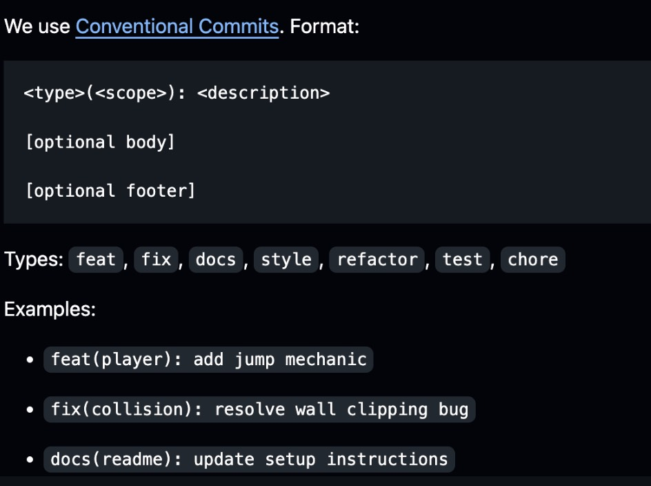

# References

Here are the references you can read:
- Josh’s contributing.md, https://github.com/UoB-COMSM0166/2026-group-16/blob/main/docs/CONTRIBUTING.md
- Conventional commits, I personally prefer don’t create too much chores, https://www.bavaga.com/blog/2025/01/27/my-ultimate-conventional-commit-types-cheatsheet/
- Commits description formats, https://www.conventionalcommits.org/en/v1.0.0/
- Examples
  - https://github.com/pixijs/pixijs
  - https://github.com/UoB-COMSM0166/2025-group-6

## Branches

**Everything’s in main:**  
The simplest way is to upload everything to main, which was adopted by 90% of groups since it’s a very small project. Individual contributions can be seen through insights and actions.
 
**Concise branches and trade-off:**  
Another way is to create concise branches based on task types, following the Conventional Commits convention. Having too many branches or long-lived branches is also a waste. 
Once we choose this approach, we need to learn skills to avoid conflicts when multiple people want to modify the same file, for example the README in the main branch. Meanwhile, it can be risky if another member wants to add something to a branch you created. 
Some people suggest that using branches and pull requests can demonstrate more structured collaboration and potentially lead to higher marks. That may be true in some cases, but many groups achieve excellent results with simpler approaches as well. Ultimately, it's a trade-off between added safety and workflow simplicity. From my perspective, actively interacting and sharing ideas with other groups is also an excellent way to showcase our collaboration skills.

## Commits

Sometimes, automatically-generated descriptions are enough. However, if we want to do more complex features, we need to use description formats. Here are 2 quick screenshots for reference: 

## Common issues

- **Branching**
    - Using personal names for branches instead of feature-based names
- **Commits**
    - One commit includes too many changes, not following the **one issue, one commit** principle
    - Using past tense in commit messages
    - Not distinguishing between `feature` and `fix` types
    - Using `doc` instead of the correct `docs`
- **Merge / Sync Workflow**
    - Unnecessary merge commits caused by pulling from the remote branch, shown in messages like `Merge branch 'main' of https://github.com/...`
    - Pulling updates after local edits and then pushing, causing duplicated game code files
- **Issue Management**
    - Closing issues without team coordination
- **File / Path Management**
    - Incorrect image reference paths
- **Documentation / Markdown**
    - Lack of a concise and clean Markdown style in technical documentation
- **Typos / Writing Conventions**
    - Typos such as `assets` vs `asserts`
    - Missing spaces after punctuation
