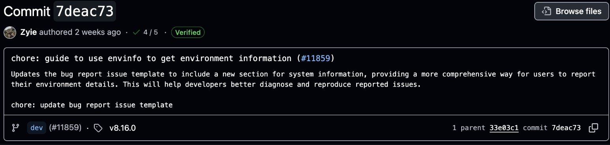

# References

Here are the references you can read:
- Josh’s contributing.md, https://github.com/UoB-COMSM0166/2026-group-16/blob/main/docs/CONTRIBUTING.md
- Conventional commits, I personally prefer don’t create too much chores, https://www.bavaga.com/blog/2025/01/27/my-ultimate-conventional-commit-types-cheatsheet/
- Commits description formats, https://www.conventionalcommits.org/en/v1.0.0/
- Examples
  - https://github.com/pixijs/pixijs
  - https://github.com/UoB-COMSM0166/2025-group-6

## Branches

**Everything’s in main:** The simplest way is to upload everything to main, which was adopted by 90% of groups since it’s a very small project. If someone is worrying that profs cannot see your contributions, just have a look at insights and actions which will be checked by profs. One thing is clear: they are not creepy as you thought.

**Concise branches and trade-off:** Another way is to create concise branches based on certain types, aka conventional commits. Professionally, in any repo, programmers won’t name branches with personal first names. Massive branches are also a waste. Once we choose this way, we need to learn skills to avoid conflicts when people want to modify the same document, i.e. README in main branches. Meanwhile, it will be risky if another member wants to add something in a branch created by you. Some people suggest this will let us get higher marks. It is, but most groups use the simplest way and still got even the highest mark. That’s basically the trade-off. In my perspective, interactions with other groups is also a great way to showcase our collaboration skills. 

## Commits

Sometimes, automatically-generated descriptions are enough. However, if we want to do more complex features, we need to use description formats. Here are 2 quick screenshots for reference: 

