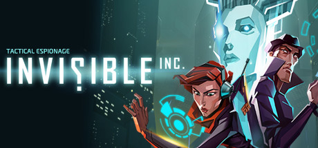
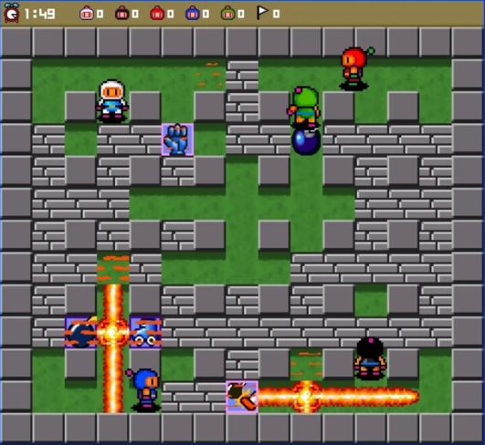

# Game Idea: Invisible Inc.

**Author:** Tracy Cui

**Genre:** Turn-Based Tactical Stealth Game (with Roguelike Elements)

**Core Concept:** Invisible Inc. is a tense turn-based stealth game where you play as the last operator of a failing private espionage agency in a near-future corporate-dominated world. After a devastating attack, you must guide elite agents through high-risk infiltrations to steal technology, rescue allies, gather funds, and upgrade your systems—all while racing against a brutal 72-hour global countdown before the agency is shut down forever.

**Gameplay Elements:**

- **Turn-Based Stealth & Detection Mechanics**  
  - Agents have limited Action Points (AP) per turn for movement, cover, silent takedowns, and item use  
  - Players must avoid guard sight cones, cameras, and sensors  
  - Detection raises the alarm level, summoning reinforcements and locking down the facility  

- **Agent Management, Customization & Permadeath**  
  - Start with 2 agents and rescue more during missions  
  - Each agent has unique abilities, 4 upgradeable skill trees, and powerful cybernetic augments  
  - Agents who die are permanently lost unless extracted quickly, creating high-stakes decisions  

- **Procedural Generation, Hacking & Campaign Pressure**  
  - Fully procedurally generated facilities with unique layouts, patrols, security, and objectives  
  - Spend scarce PWR to let AI Incognita hack doors, disable cameras, loop feeds, and create distractions  
  - 72-hour campaign timer forces constant prioritization between risky high-reward missions and safer operations  
  - Perfect stealth maximizes rewards; alarms and combat drastically reduce payouts and risk agent loss  

**Themes and Appeal:**

- Pure tension and satisfaction from flawless undetected infiltrations  
- Cyberpunk atmosphere of corporate oppression, fragile alliances, and desperate improvisation  
- Extremely high replayability through procedural levels, agent synergies, augment combinations, and multiple valid approaches (shadows, distractions, timing, hacking)  
- Every run feels fresh, punishing, and addictive

# Game Idea: Portal Bomber

**Author:** Haris Kovac

**Genre:** Local 2-Player Competitive Action Bomberman (with Portal Twist)

**Core Concept:** Portal Bomber is an intense 2-player local multiplayer arena battler where rivals drop bombs to clear paths, snag power-ups, rack up points by smashing blocks and enemies, and try to eliminate each other before time runs out. Kicking bombs and placing portals add chaotic strategy—teleport yourself for escapes, funnel enemies into kill zones, or redirect blasts at your opponent—while procedural maps and escalating enemies ensure fair, replayable showdowns.

**Gameplay Elements:**

- **Movement, Bombs & Kicking Mechanics**  
  - P1: WASD to move, Space to drop bombs (starts with 2 active bombs, range 2 tiles), C to place portals (up to 2; third replaces oldest)  
  - P2: Arrows to move, Right Shift to drop, Right Ctrl for portals  
  - Run into your dropped bomb to kick it, sending it rolling until it hits an enemy, player, or wall  
  - Destroy soft blocks to earn points and reveal paths/power-ups; avoid enemy/bomb hits or die instantly  

- **Portals, Enemies & Procedural Arena**  
  - Portals teleport players, enemies, and kicked bombs instantly (enemies/bombs can use portals too for deadly surprises)  
  - Procedural map generation places soft blocks fairly for both players; enemies spawn at visible safe spots with increasing frequency (hard mode: more enemies, fewer items)  
  - Bat (fast, random movement), Ghost (slow, but phases through blocks and chases the nearest player), Teleporter (3 lives, teleports each time it's hit)  

- **Power-Ups, Scoring & Win Conditions**  
  - 10% drop chance from blocks/enemies: Fire (increased blast range), Bomb-Up (more active bombs), Skate (speed boost), Invincibility (temporary immunity)  
  - Increase your score by destroying enemies/blocks; instant win by killing opponent, else highest score after timer  
  - Persistent local leaderboard (localStorage)

**Themes and Appeal:**  
- Frantic chaos and mind games from portals turning defense into offense  
- Pure local multiplayer rivalry with fair procedural maps and escalating tension  
- Addictive "one more round" replayability via power-up synergies, enemy variety, leaderboards, and hard mode
